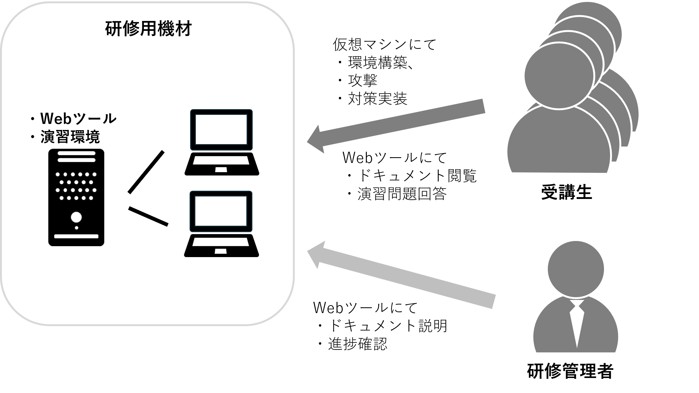

<link rel="stylesheet" href="/public/css/markdown-common.css">

導入
=======

# 本研修の目的
本研修は下記の目的で実施します。
- 基礎的な業務システムの動作原理を理解する
- 基礎的なサイバー攻撃の動作原理を理解する
- 動作原理を理解したうえでの対策検討ができるようになる
- システム及びサイバー攻撃の動作原理を理解したうえで対策を実施していくことの重要性を理解する

# 本研修の概要

　本研修では、システムの構築・サイバー攻撃・セキュリティ対策を実際に手を動かして実践することで、机上の勉強のみでは理解しがたいシステムの動作原理、サイバー攻撃の動作原理、セキュリティ対策の本質的な効果を学ぶことができます。   

　受講生は研修環境を有したサーバに接続したPCを操作して仮想サーバソフトを用いてシステムの構築・サイバー模擬攻撃・セキュリティ対策実装および動作確認を行います。また、サーバ内に用意した研修用Webツールに研修用アカウントでログインすることで講義資料の閲覧、事前に用意した演習問題の回答を行えます。   
　研修の管理者は同じ研修用Webツールに管理者アカウントでログインすることで講義資料の説明、それぞれの受講生の講義及び演習問題回答の進捗確認を行うことができます。

 

　また、本研修で作成した環境を使うと、用意した構築環境やサイバー模擬攻撃以外にも、様々な種類の環境構築やサイバー模擬攻撃を実践することができます。日頃から気になっているセキュリティ製品の試用や流行しているサイバー攻撃の勉強にご利用ください。

# 注意事項
- 本研修でご用意したサイバー攻撃に対してのみ対策を行えば良いという訳ではありません。世の中には様々な種類のサイバー攻撃が存在します。世界の脅威事情にアンテナを張り、必要なセキュリティ対策を行うようにしてください。
- 本研修でご紹介したセキュリティ対策のみ実施すれば良いという訳ではありません。自社のシステムの動作原理を理解し、自社の資産を守るために必要なセキュリティ対策を施してください。