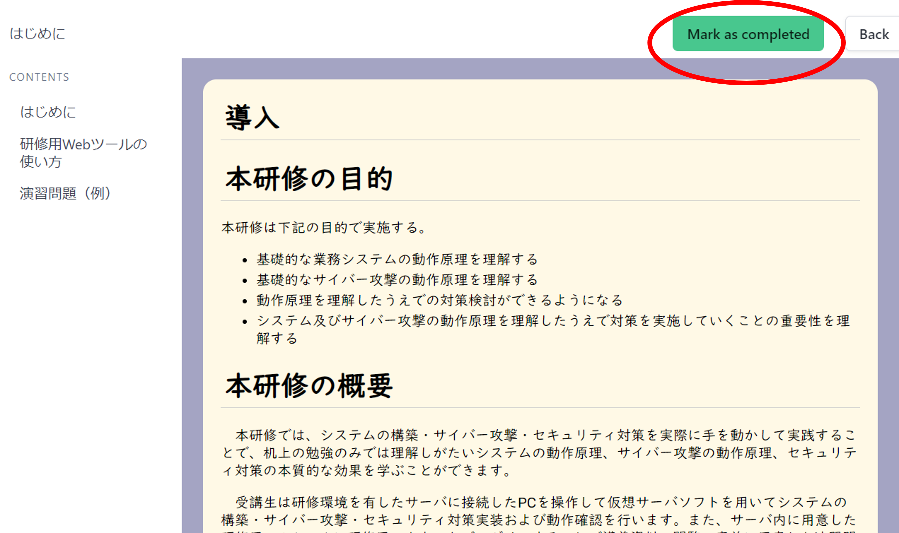
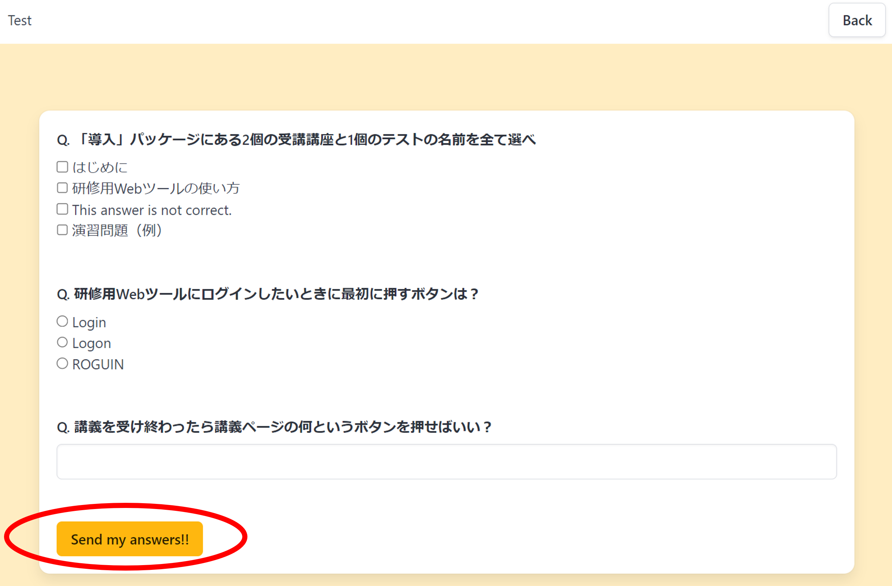

<link rel="stylesheet" href="/public/css/markdown-common.css">

研修用Webツールの使い方
=======

# 研修用Webツール
研修環境内にあるWebサーバに用意した研修用Webツールを利用することで受講生は講義資料の閲覧、事前に用意した演習問題の回答を行えます。   
研修の管理者は研修用Webツールに管理者アカウントで講義資料の説明、それぞれの受講生の講義及び演習問題回答の進捗確認を行うことができます。

# 研修用Webツールの使い方
## アクセス
ブラウザで"http://[WebサーバのIPアドレス]:3000"にアクセスする。
例：http://192.168.5.100:3000

## ユーザ作成
1. ホーム画面（ログイン前）から"Registration"ボタンを押下する。 

 

2. ユーザ名、メールアドレス、パスワードを入力し、"Registration"ボタンを押下する。 

 

## ログイン
1. ホーム画面（ログイン前）から"Login"ボタンを押下する。 

 

2. ユーザ名、パスワードを入力して”Login”ボタンを押下する。 

 

## 講義資料閲覧
1. ログイン後の画面で"Enter"ボタンを押下する。 

 

2. 受講したいコースを選択する。 

 

3. 受講したいパッケージを選択する。 

 

4. 受講したい研修ドキュメントを選択する。（"Type:doc"が研修ドキュメント） 

 

5. 受講が完了したら受講が終わったら”Mark as completed”をクリックする。 
　（管理者側で受講が完了したことを確認できます）。 

 

## 演習問題回答
1. 受講項目を選択する画面（[講師資料閲覧](#講義資料閲覧) を参照）で受講したいテストを選択する。（"Type:test"がテスト） 

 

2. 解答する。
3. 解答が完了したら”Send my answers!!”をクリックする 

 

4. 結果が表示される。

 