<link rel="stylesheet" href="/public/css/markdown-common.css">

システム構築演習
=======

# このセクションの目標

物理的な機器構成、ハイパーバイザー、OS、ネットワークの基礎について理解します。

# 構成図
本研修で構築するシステムの構成図を紹介します。

## 論理構成図
<div class="image">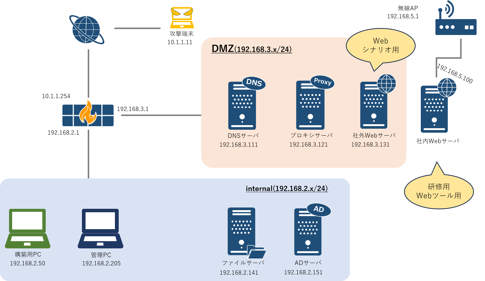</div><br>

## 物理構成図
<div class="image">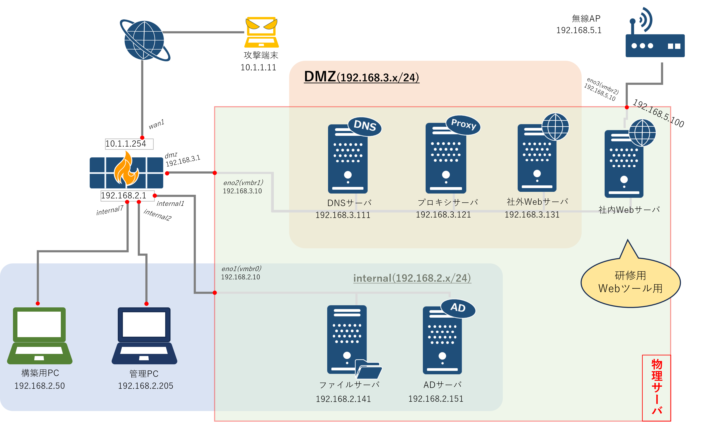</div>
※[enoX]は物理インタフェース、[vmbrX]は仮想インタフェースを示す。

## 配線図
<div class="image">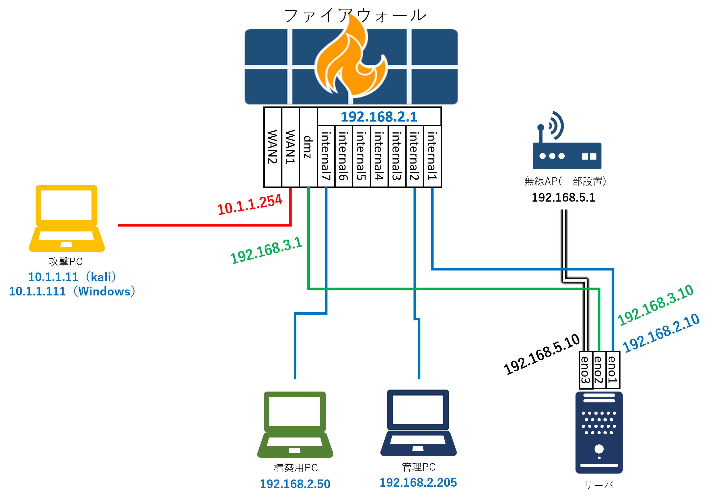</div><br>


# 構築PCの確認
- 構築PC：本研修の構築に利用するPCです。業務には利用していません。

<div class="image">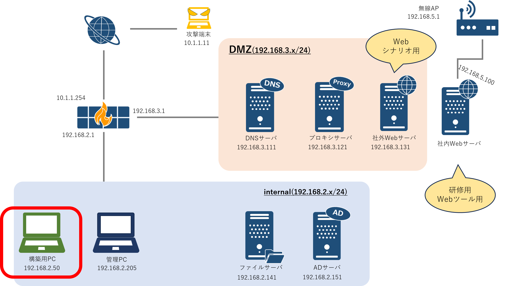</div><br>

- 構築用PCを起動し、Windowsにログインします。
- 以下を確認します。
    - サーバ機器と疎通確認ができること
        - コマンドプロンプト もしくは PowerShellを開く
        - 下記コマンドを打つ  
            - `ping 192.168.2.10`  <br>
              ※"ping"はネットワークの疎通を確認するコマンド 
            - 下記のように表示されればOK。
            ```
            > ping 192.168.2.10

            192.168.2.10 に ping を送信しています 32 バイトのデータ:
            192.168.2.10 からの応答: バイト数 =32 時間 <1ms TTL=64
            192.168.2.10 からの応答: バイト数 =32 時間 =1ms TTL=64
            192.168.2.10 からの応答: バイト数 =32 時間 =1ms TTL=64
            ```
            - 下記のように表示されればNG。           
            ```
            > ping 192.168.2.10

            192.168.2.10 に ping を送信しています 32 バイトのデータ:
            192.168.2.50 からの応答: 宛先ホストに到達できません。
            要求がタイムアウトしました。
            ```

# 管理PCの確認
- 管理PC：システムの管理者が通常業務及びADサーバ等のシステム管理で使用しています。

<div class="image">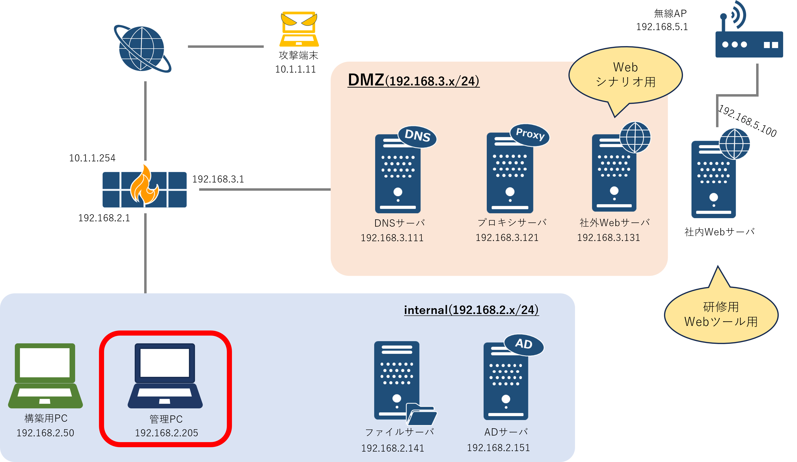</div><br>

- 管理PCを起動し、Windowsにログインします。
   - ユーザ名：localadmin
   - パスワード：Passw0rd!
- 以下を確認します。
    - ADサーバと疎通確認ができること（ping）
        - コマンドプロンプト もしくは PowerShellを開く
        - 下記コマンドを打つ  
            - `ping 192.168.2.151`  <br>

# ハイパーバイザー
## 本研修でのシステム構成
<div class="image">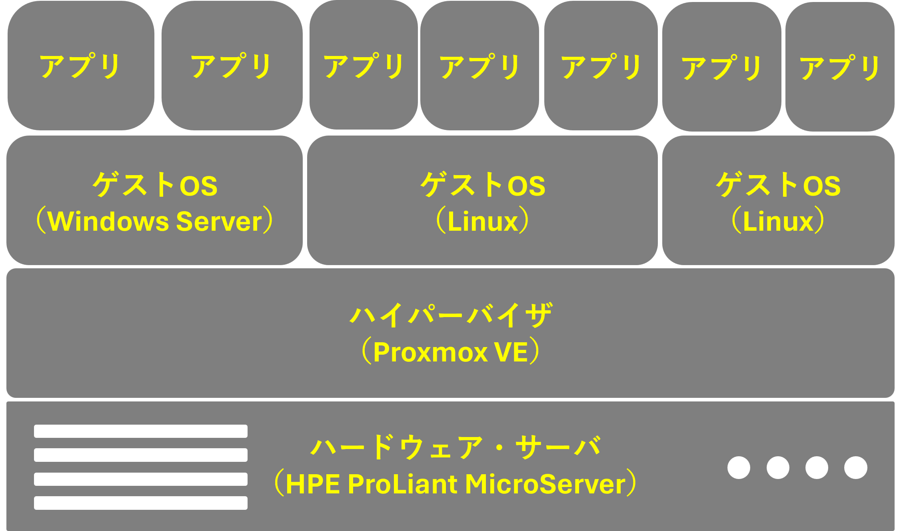</div><br>

- 今回の研修では、物理的なサーバーとしてはHPE ProLiant MicroServerという機器を使っています
- 複数の環境(OS)を1台のサーバーで動作させるために、仮想環境を使用しています
- 仮想環境にもいくつか種類がありますが、今回はハイパーバイザー型のProxmox VEというソフトウェアを使用しています

## 操作してみよう
- ブラウザでProxmox VEの管理画面にログインできることを確認します
    - ブラウザで、https://192.168.2.10:8006/ を開く
        - 以下を入力します。
            - User name: user
            - Password: Passw0rd!
            - Realm: Proxmox VE authentication server
        - No valid subscription の画面が出たらOKをクリックする
            <div class="image">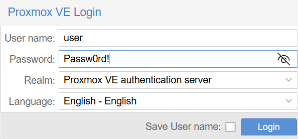</div><br><br>

- ブラウザでProxmox VEの各端末のコンソールが開けることを確認します
    - Proxmox VE画面の説明
        - 左メニューの Datacenter の下にある "pve" をダブルクリックし、仮想マシン一覧を表示します
            <div class="image">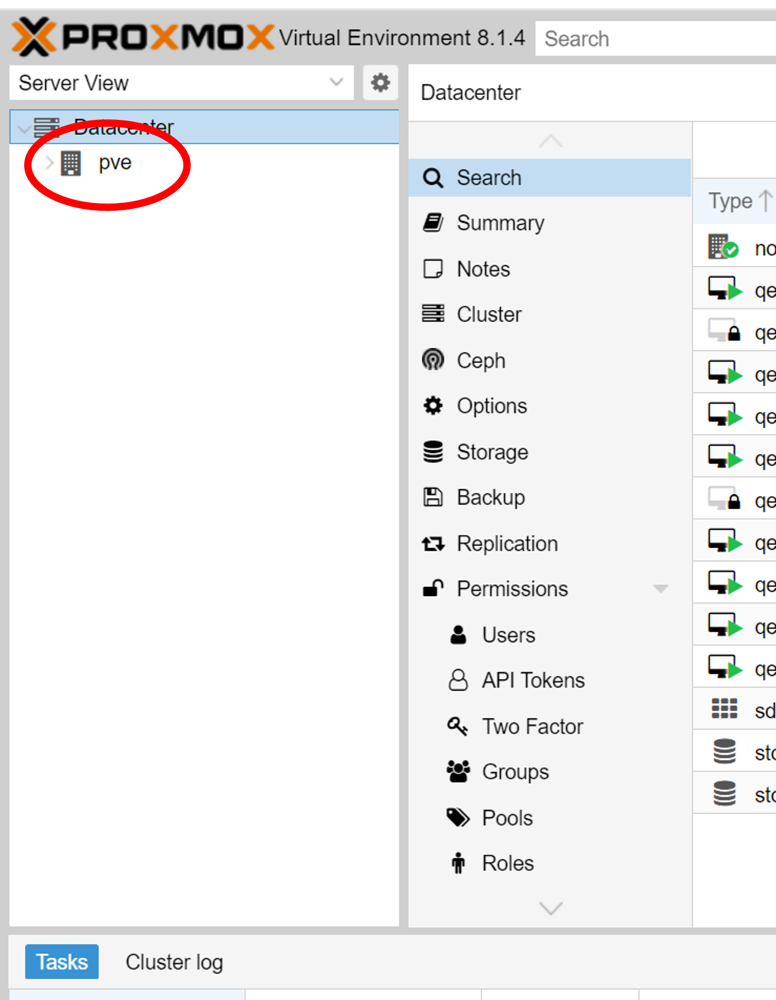</div>
        
        - 仮想マシン一覧から "151(AD)" を選択します
            <div class="image">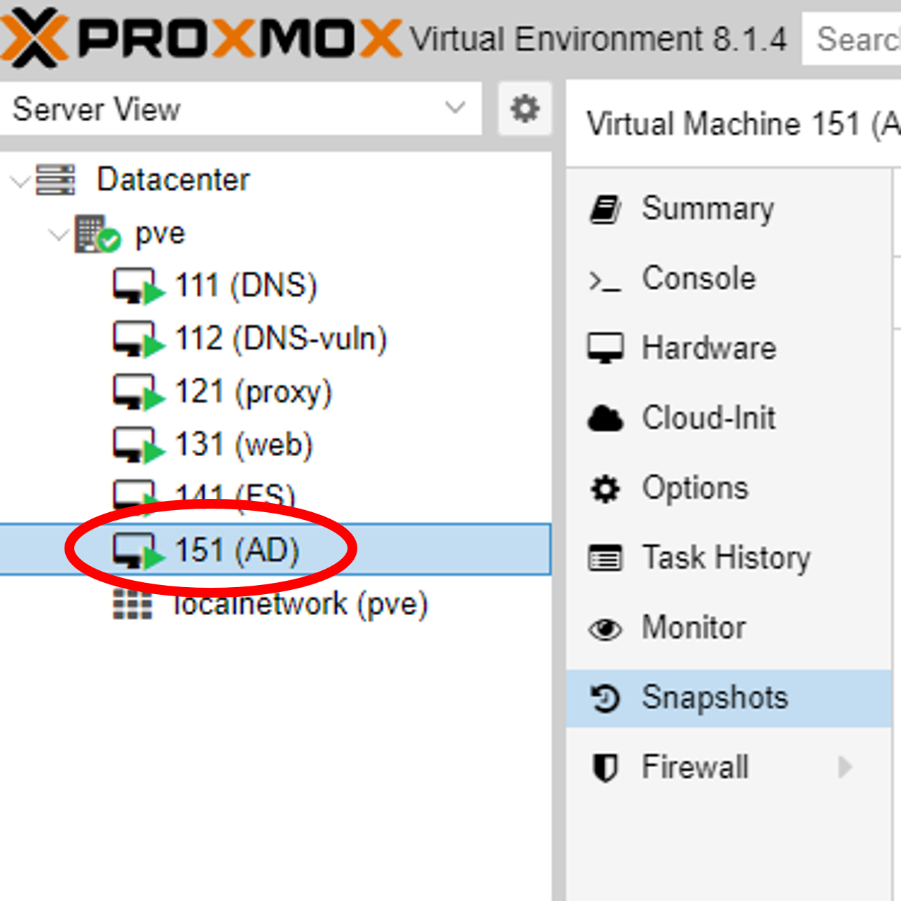</div>
        
        - "151(AD)"をダブルクリック、もしくは右上の "Console" をクリックします
            <div class="image">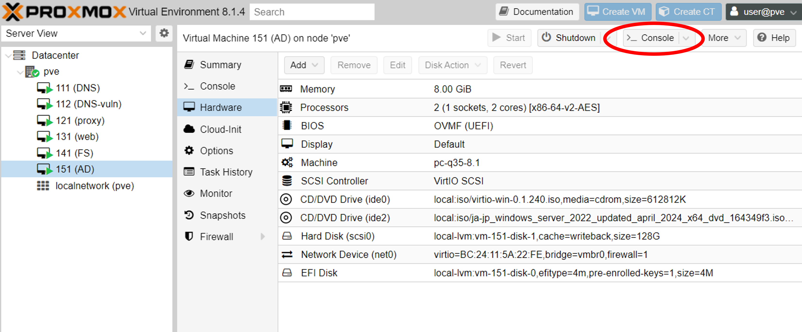</div><br>

        - ブラウザのウィンドウが開き、Windowsの画面が表示されることを確認します
        
        - なお、Ctrl-Alt-Deleteを入力する際は、画面の左側にあるメニューを使用します
            <div class="image">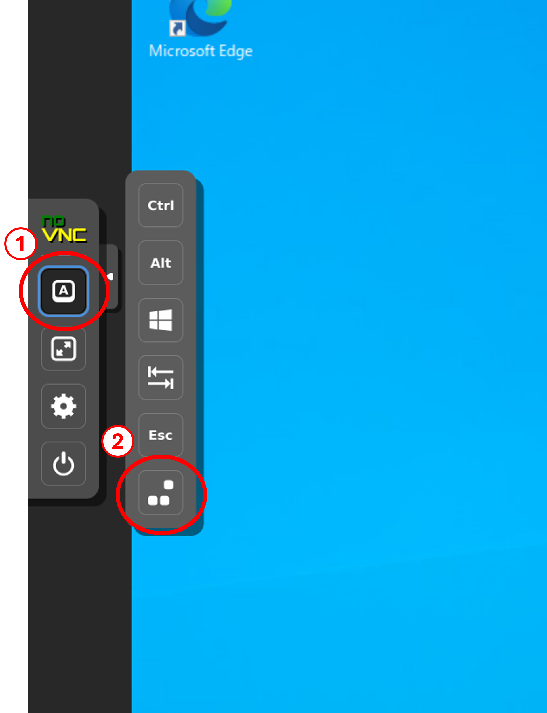</div>

        - 画面表示がスクリーンと合っておらず見づらい場合は、画面の左側にあるメニューから「スケーリングモード」を『ローカルスケーリング』に設定します。
            <div class="image">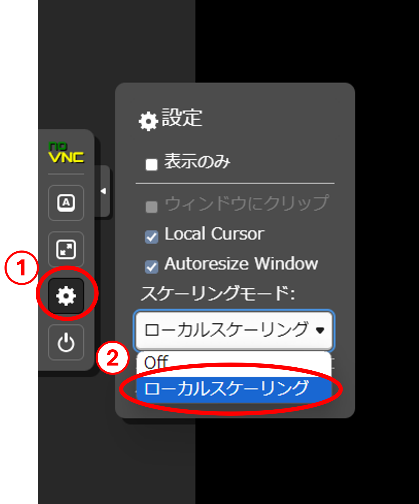</div>

# ファイアウォール
## ファイアウォールとは
ファイアウォールは通信パケットの送信元IPアドレスや宛先IPアドレス、通信プロトコルなどを解析し、通過させるか遮断させるかを判断する「パケットフィルタリング」などの機能を有した機器です。

<div class="image">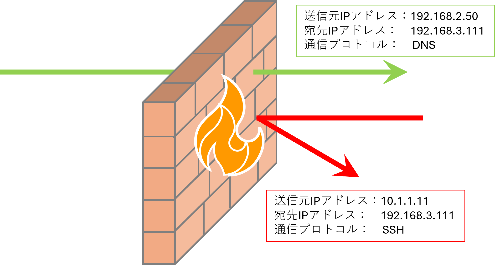</div><br><br>

### ステートフルインスペクションの仕組み
パケットフィルタリング機能・方式の1種です。通信内容の通信可否を動的に判断します。通信の前後関係を把握して許可・拒否を判定するため、戻りの通信パケットの設定を考慮に入れなる必要がなくなります。

<div class="image">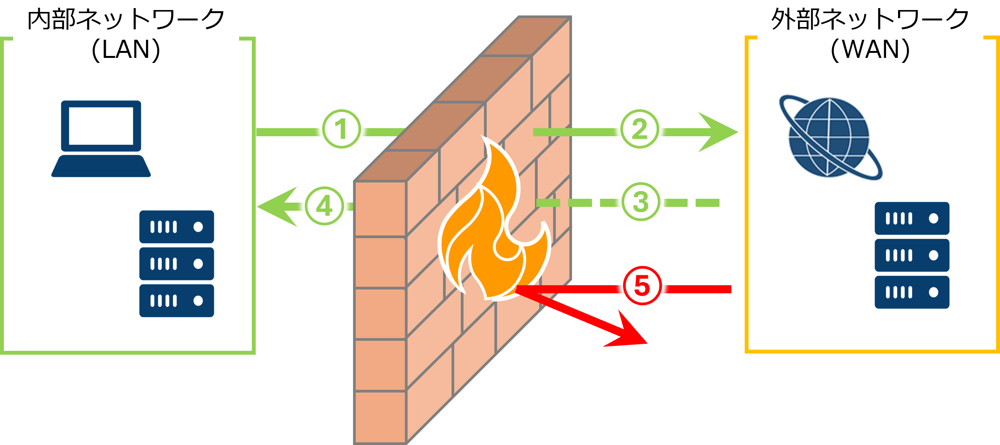</div><br>

①通信パケットの通信可否を判断する<br>
②許可した通信パケットのデータを記録する<br>
③記録したデータを元に、戻って来たデータに不正がないかチェックする<br>
④正常と判断された通信パケットの通過を許可する<br>
⑤不正と判断された通信パケットの通過を拒否する<br>

## 構築してみよう

<div class="image">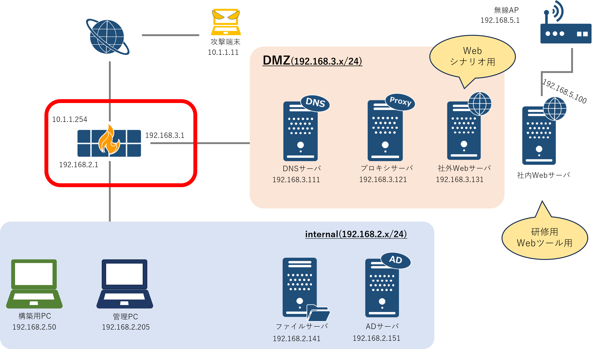</div><br>

- 以下を確認します
    - ファイアウォールの管理画面が開けること
        - 構築PCのブラウザで、https://192.168.2.1/ を開きます。
        - ユーザー名・パスワードを入力し、"ログイン"ボタンを押します。
            - ユーザー名：admin
            - パスワード：Passw0rd!
                <div class="image">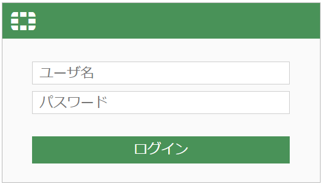</div><br>

        - "FortiGateセットアップ" 画面が表示された場合、"後で"ボタンを押します。
            <div class="image">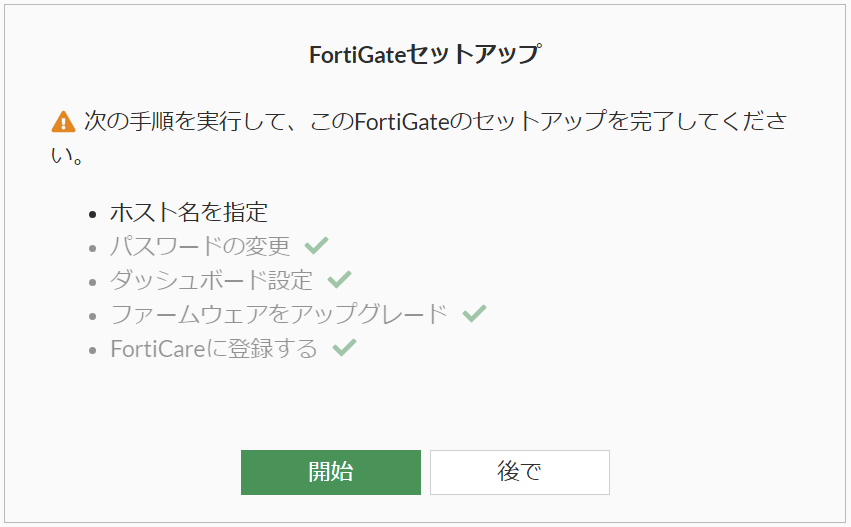</div><br><br>


### インターフェース
- 今回の研修では、以下のようにインターフェースを使い分けています
    <div class="image">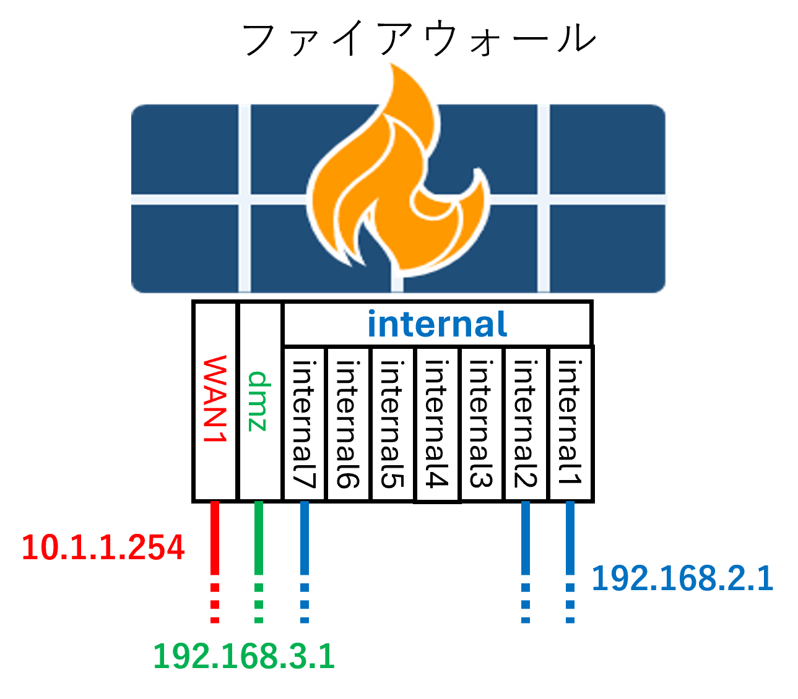</div><br>
    <div class="image">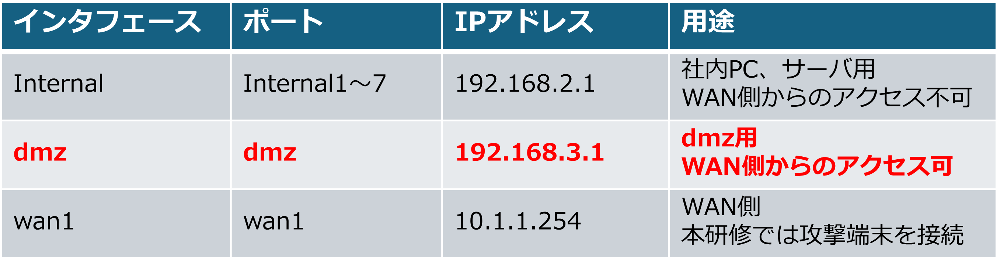</div><br><br>

#### インターフェース設定
1. 左側の項目から「ネットワーク」→「インターフェース」を選択する。  
※「ダッシュボード」→「ネットワーク」ではなく、その下の「ネットワーク」→「インターフェース」<br><br>

1. 「物理インターフェース」→「dmz」を右クリックし、「編集」を押す。<br>
    ※「dmz」をダブルクリックしても「編集」と同じ画面に変わる。
    <div class="image">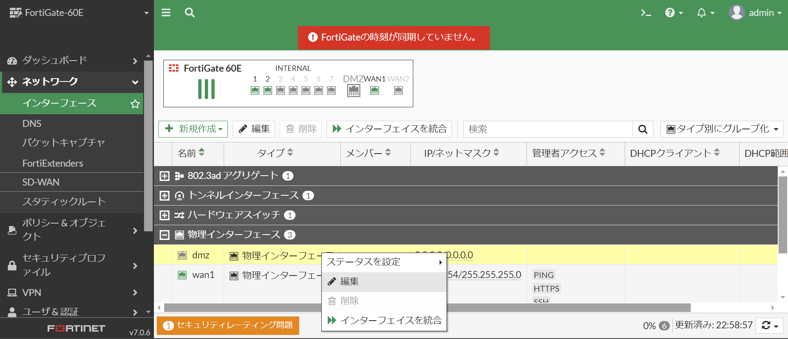</div><br><br>

1. 「アドレス」→「IP/ネットマスク」を以下に変更する。
    - 192.168.3.1/255.255.255.0
    <br><br>

1. 「管理者アクセス」→ 「PING」にチェックを入れる。
    <div class="image">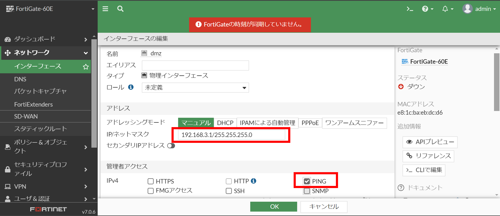</div><br><br>

1. 「その他」→「有効化済み」をクリック。 
    <div class="image">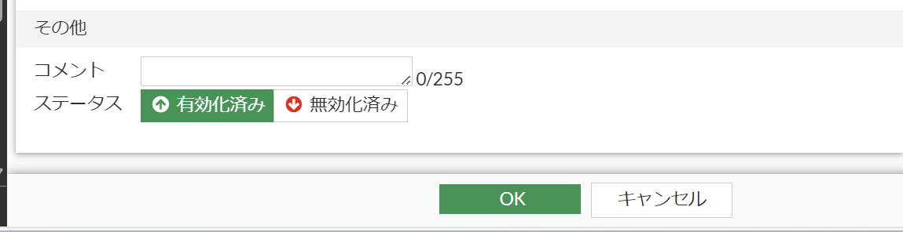</div><br><br>

1. 画面の下側に"OK"ボタンを押す。<br><br>

### ポリシー
また、今回の研修ではまず下表のとおりパケットフィルタリングを行います。
<div class="image">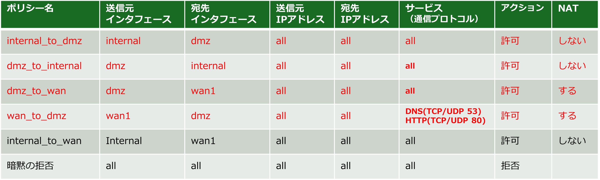</div><br>

#### ポリシーの見方
ポリシーは上から順に該当する通信の許可/拒否を判断し、どれにも該当しない通信が  
最下段「暗黙の拒否」ポリシーに該当し、拒否される。  
上記のポリシーでは、 **インターネット（wan）側から社内セグメント（internal）の通信は全て拒否される** 。 
<div class="image">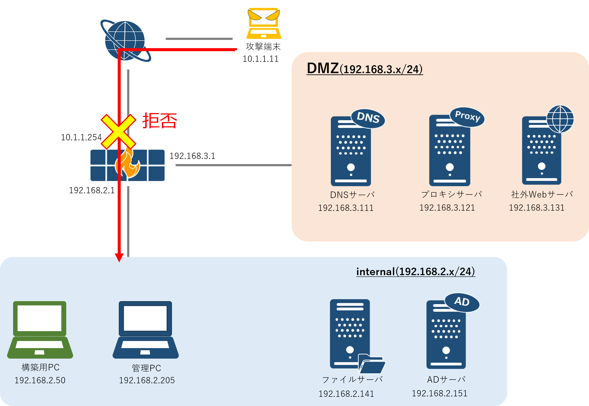</div><br>

#### ポリシー設定
赤字で示したdmz関係のポリシーを作成できていません。作成してみてください。

1. 左側の項目から「ポリシー＆オブジェクト」→「ファイアウォールポリシー」または「IPv4ポリシー」を選択する。<br><br>

1. 「新規作成」を選択する。<br><br>

1. 以下設定を入力し、画面の下側の"OK"ボタンを押す。<br><br>
    - 名前：dmz\_to\_internal
    - 着信インターフェース：dmz
    - 送信インターフェース：internal
    - 送信元：all
    - 宛先：all
    - サービス：all
    - アクション：許可
    - NAT：しない
        <div class="image">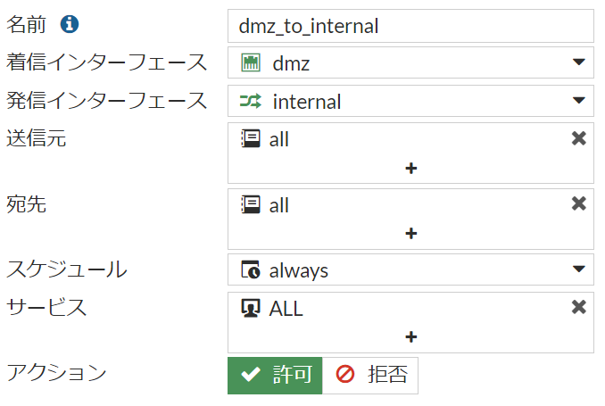</div><br><br>

1. ここまでを参考に他の全てのポリシーを設定してみてください。<br><br>

1. 動作確認を行う
   - 動作確認(一部)
      - 管理PCからDNSにpingを送り応答が返ること  
         - `ping 192.168.3.111`
      - 攻撃PCからDNSにpingを送り応答が **返らない**  こと（pingのプロトコルであるICMPを許可していない）  
         - `ping 192.168.3.111`
