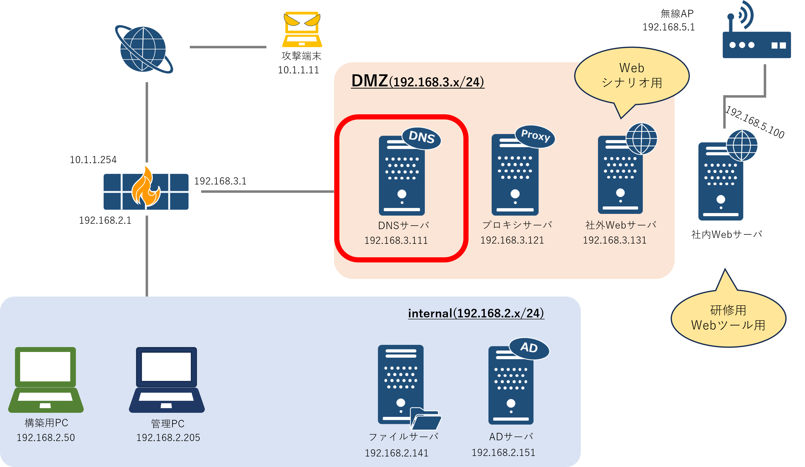

<link rel="stylesheet" href="/public/css/markdown-common.css">

システム構築演習(DNS)
======================

# DNSとは

- DNSはDomain Name Systemを略した名称である
- インターネット上でドメイン名を管理・運用するための仕組み
- 基本機能はドメイン名に対応するIPアドレスを利用者に応答すること  
- このドメイン名をIPアドレスに変換する動作は、"名前解決"と呼ばれる
    - 例: ドメイン名（www.example.com）をIPアドレス（192.0.2.100）に変換する  <br>
    ※正確には、"example.com"をドメイン名、"www"をホスト名、"www.example.com"をFQDNと言う。
    <div class="image"></div>

- DNSによって、ユーザはIPアドレスを意識することなくドメイン名でアクセスができる
- DNSには「権威DNSサーバ（コンテンツサーバ）」と「キャッシュDNSサーバ」がある

## 権威DNSサーバ

- 自身が管理するドメインの情報について回答できる
- 階層構造になっており、 `www.example.com` は以下のように複数の権威DNSサーバに分散して管理されている
    - ルートサーバ: "example.com"のことは知らないが、".com" を管理する権威DNSサーバのIPアドレスを知っている
    - "com" 権威DNSサーバ: "www.example.com" のことは知らないが、"example.com" を管理する権威DNSサーバのIPアドレスを知っている
    - "example.com" 権威DNSサーバ: "www.example.com" のIPアドレスを知っている
- DNSを使う人は、上位のサーバから順番に問い合わせを行う(反復問い合わせ)

## キャッシュDNSサーバ

- 個々のPCが毎回反復問い合わせを行うのは、DNSサーバ/PCどちらにとっても負担である
- 個々のPCはキャッシュDNSサーバに問い合わせを行い、キャッシュDNSサーバが代理で反復問い合わせを行う
- キャッシュDNSサーバは、反復問い合わせの結果をキャッシュしているため、次回同じ問い合わせが来たときは素早く答えることができる
    <div class="image"></div>

## BINDについて

- BINDとは
    - DNSサーバのためのオープンソースソフトウェア。BINDをサーバにインストールし、必要な設定を施すことで、サーバをDNSとして機能させることができる。長年にわたり、全世界で広く使われている。
    <div class="image"></div>

- BINDで利用されるファイルは設定ファイルとゾーンファイルが存在する
    - 設定ファイル
        - BINDの基本設定を定義するファイル。主に以下の事項を定義する。
            - BINDで処理を受け付けるIPやポート
            - BINDが参照するゾーンファイル
            - クライアントからの名前解決の問い合わせに対して、自身が責任をもって回答するドメイン
            - 回答ができない場合に、別のDNSに問い合わせを転送するドメイン
        - 今回はnamed.confというファイルとして存在する。
    - ゾーンファイル
        - ドメイン名とIPの対応関係を定義している。ゾーンファイルの内容に基づいて、BINDが名前解決を行う。
        - 今回はsalgroup.local.zoneというファイルとして存在する。


# DNSのセットアップ

<div class="image"></div><br>

## 前提
- BINDのインストールまで完了している
- 本研修では、設定ファイルおよびゾーンファイルの修正を行う。

- 今回はインターネットに接続できないため、キャッシュDNSサーバとしての動作確認はしない
- 権威DNSサーバを設定し、WAN側から名前解決ができることを確認する

## 事前準備

- 構築PCでProxmoxの管理画面に接続し、DNSの仮想マシンのコンソールを立ち上げる
- DNSには以下のユーザ名とパスワードでログインする
    - ユーザ名：root
    - パスワード：Passw0rd!


- 設定内容
    - 今回は以下のファイルにそれぞれ設定を行う
        - 設定ファイル
            - DNSサーバの受信設定
            - BINDを権威DNSとして設定する
        - ゾーンファイル
            - DNSサーバとWebサーバのドメイン名をIPに変換するルールを定義


- 設定ファイルはテキストエディターか、viコマンドで編集ができる
    - テキストエディターで操作するときは以下の手順で進める
        1. アクティビティをクリック
            <div style="text-align: left;">
            
            </div><br><br>
        
        1. 画面下の端末をクリック
            <div style="text-align: left;">
            
            </div><br><br>

        1. 出てきたターミナルで ファイルごとに以下のコマンドを使う<br>※文字を拡大する際は「Ctrl + Shift + ＋」、縮小する際は「Ctrl + －」
            -  named.confを編集するときのコマンドは以下を使う
                - `gedit /etc/named.conf`
            - salgroup.com.zoneを編集するときのコマンドは以下を使う
                - `gedit /var/named/salgroup.com.zone`<br><br>

        1. 編集後、保存して閉じる<br><br>

    - viで操作するときは、上記のテキストエディターでの手順を項番2まで進めて、ファイルごとに以下のコマンドを使う
        - named.confを編集するときのコマンド
            - `vi /etc/named.conf`<br><br>

        - salgroup.com.zoneを編集するときのコマンド
            - `vi /var/named/salgroup.com.zone`<br><br>

    - viコマンドでファイルを開いた後に、テキストを編集する方法については以下を参照
        - [vi-instruction](vi-instruction.md)<br><br>

## confファイルの設定

`named.conf`はBINDの設定ファイルであり、DNSの振る舞いなどを定義する<br>
ここからの作業では、DNSサーバがsalgroup.comの名前解決の問い合わせを処理するための設定を行う
- ファイルの修正前の部分を修正後の内容に編集する
- ファイルのパスは以下の通り
    -  `/etc/named.conf`<br><br>


1. DNSサーバの受信設定
    - 修正前
        ```
        listen-on port XX { XXX; };	//DNSのIPアドレス
        ```
    - 修正後
        ```
        listen-on port 53 { 192.168.3.111; };	//DNSのIPアドレス
        ```
    - 上記の設定は、DNSサーバの53番ポートで受信した通信をBINDで処理することを意味している<br><br>

1. BINDを権威DNSとして設定する
    - 修正前
        ```
        #zone "salgroup.com" IN {
        #	type master;
        #	file "/var/named/salgroup.com.zone";
        #};
        ```
    - 修正後(#を消して、コメントアウトを解除)
        ```
        zone "salgroup.com" IN {
            type master;
            file "/var/named/salgroup.com.zone";
        };
        ```
        
    - 上記の設定は、salgroup.comに属するホストの名前解決ルールなどの情報がsalgroup.com.zoneというゾーンファイルに記載されていることを示している<br>行ごとの意味は以下の通り
        - salgroup.comのゾーンファイルを定義することを宣言
            ```
            zone "salgroup.com" IN {
            ```
        - 複数のDNSサーバが動作する場合、このDNSサーバをメインのサーバ（プライマリDNSサーバ）とすることを宣言
            ```
            type master;
            ```
        - salgroup.comの名前解決には/var/named/salgroup.com.zoneのゾーンファイルを参照する
            ```
            file "/var/named/salgroup.com.zone";  
            ```
        - 設定の終了を示す
            ```
            };
            ```
            <br><br>
                  

## ゾーンファイルの設定

`salgroup.com.zone`はsalgroup.comに関するゾーンファイルであり、ゾーンに関する情報や応答する内容が記述されている<br>
ここからの作業では、DNSサーバとWebサーバのドメイン名をIPに変換する設定を行う

- ファイルの修正前の部分を修正後の内容に編集する
- ファイルのパスは以下の通り
    - `/var/named/salgroup.com.zone`

- DNSサーバとWebサーバのドメイン名をIPに変換するルールを定義
    - 修正前
        ```
        $TTL    86400
        @   IN  SOA     ns.salgroup.com. root.salgroup.com.{
                        2024051001  ;Serial
                        3600        ;Refresh
                        1800        ;Retry
                        604800      ;Expire
                        86400       ;Minimum TTL
        }
        @   IN  NS      ns.salgroup.com.
        ns  IN  A       XXX
        www IN  A       XXX
        ```
    - 修正後(nsおよびwwwのIPアドレスを修正)
        ```
        $TTL    86400
        @   IN  SOA     ns.salgroup.com. root.salgroup.com.{
                        2024051001  ;Serial
                        3600        ;Refresh
                        1800        ;Retry
                        604800      ;Expire
                        86400       ;Minimum TTL
        }
        @   IN  NS      ns.salgroup.com.
        ns  IN  A       192.168.3.111
        www IN  A       192.168.3.131
        ```
- 上記の修正後の設定は以下の内容を示している
    - "salgroup.com" に関しては、"ns.salgroup.com"(DNSサーバ)に問い合わせること
    - 管理者のメールアドレスは"root@salgroup.com"である(ファイル上では@マークを.で置き換える記載方法となっている)
    - "ns.salgroup.com"(DNSサーバ) のIPアドレスは192.168.3.111である
    - "www.salgroup.com" (Webサーバ)のIPアドレスは192.168.3.131である
        - 主要な行ごとの意味は以下の通り
            - ゾーンファイルのデータをキャッシュする時間（86400秒）を指定:
                ```
                $TTL    86400
                ```
            - プライマリDNSサーバがns.salgroup.comであることと、管理者のメールアドレスがroot@salgroup.comであること（ファイル上は@を.(ドット)で置き換えている）を定義:
                ```
                @   IN  SOA     ns.salgroup.com. root.salgroup.com.{
                ```
            - DNSサーバのホスト名(ns.salgroup.com)を記載:
                ```
                @   IN  NS      ns.salgroup.com.
                ```
            - "ns.salgroup.com"のIPアドレスは192.168.3.111である:
                ```
                ns  IN  A       192.168.3.111
                ```
            - "www.salgroup.com"のIPアドレスは192.168.3.131である:
                ```
                www IN  A       192.168.3.131
                ```


## BINDの再起動

1. 設定変更を反映させるために、BINDを再起動する
    ```c
    # systemctl restart named.service
    ```
    <br><br>

1. DNSが機能しているか確認するために、BINDのステータスを確認する
    ```c
    # systemctl status named.service
    ```
    - active (running) になっていればOK<br>
    ※ステータス確認を終えて、再度コマンドを入力するときはqを入力する
        <div style="text-align: left;">
        
        </div><br><br>
        
## 動作確認

- 本来は、salgroup.comのドメインを取得・登録することで社外インターネットから接続できるようになる
- 今回はインターネットに接続しておらず、".com" を管理する権威DNSサーバに "salgroup.com" の情報を登録していない
- 以下の手順で簡易的に社外から "salgroup.com"の名前解決ができることを確認する
    - 攻撃PCのDNSサーバの指定を192.168.3.111に設定する
    - 攻撃PCのコマンドプロンプトで以下のコマンドを実行し、問題なく名前解決の結果が返ってくるかを確認する
        ```
        nslookup www.salgroup.com
        ```
        ```
        nslookup ns.salgroup.com
        ```
    - 攻撃PCのブラウザから、 "www.salgroup.com" に接続し、ページが表示されることを確認する<br>
    ※ブラウザのアドレスバーに`http://www.salgroup.com`を入力し、Enterを押して、ページが表示されれば良い


