<link rel="stylesheet" href="/public/css/markdown-common.css">

システム構築演習（ADサーバー）
===========================================

# ユーザ
- ユーザには大きく分けて4種類ある
 <div class="image">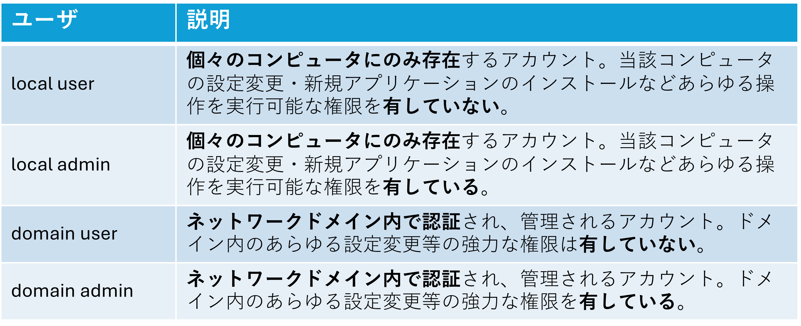</div>

# ADサーバーとは
- ADはActiveDirectoryの略称
- Windowsのユーザを一元管理することができる
- ユーザ管理が容易になる一方で、その強力な権限ゆえに攻撃者から狙われやすいという側面もある

 <div class="image">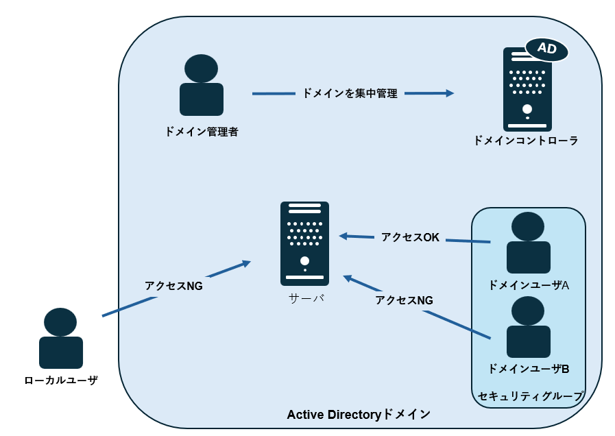</div>

- ADがコンピュータやユーザを管理する際に、ドメインという単位を利用する
- ドメインはドメインコントローラ（DC）というサーバで集中管理される
- ADの機能の一つとして、ユーザが正規のユーザかどうか認証をすることができる

- コンピュータを利用するユーザはローカルユーザとドメインユーザの2種類存在する
    - ローカルユーザ
        - ローカルユーザは、そのユーザが登録されているコンピュータのみでしか利用できない
        - ユーザの管理や認証はそのユーザが登録されているコンピュータで行う
        - 例：コンピュータAに登録されているローカルユーザはコンピュータBでは使えない
    - ドメインユーザ
        - ドメインユーザはローカルユーザと異なり、ドメインに属しているコンピュータ全てで利用することができる
        - ユーザの管理や認証については、ドメインコントローラで一元的に行う
        - 例：ドメインXに登録されているドメインユーザは、ドメインXに参加しているコンピュータA、Bのどちらでも使うことができる

- ドメインユーザの認証はユーザ名とパスワードで行う

- ActiveDirectoryでは、セキュリティグループを用いて、ユーザを管理することができる。  
セキュリティグループでは、グループごとにユーザの権限を管理することができ、効率的にセキュリティを強化することができる。


# ADサーバーのセットアップ

<div class="image">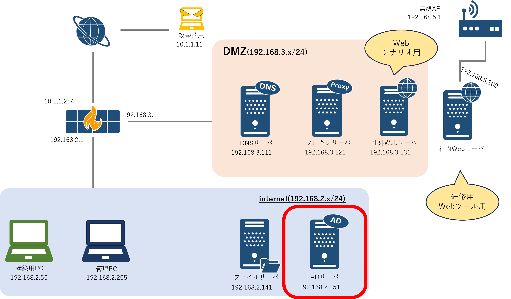</div><br>

## 前提
- 仮想マシンにWindowsServerをインストールし、ドメインコントローラとしての機能を有効化した状態から構築を始める。
- 社内のローカルドメインとしては"salgroup.local"を使用する。
- 本研修では、"salgroup.local"の名前解決については、ADサーバで実施する。
- DNSサーバに"salgroup.local"の名前解決問い合わせが来るとADサーバに転送する設定を既に行っており、転送先のADサーバはDNSとしての機能が有効化されていて"salgroup.local"の名前解決ができる
  <div class="image">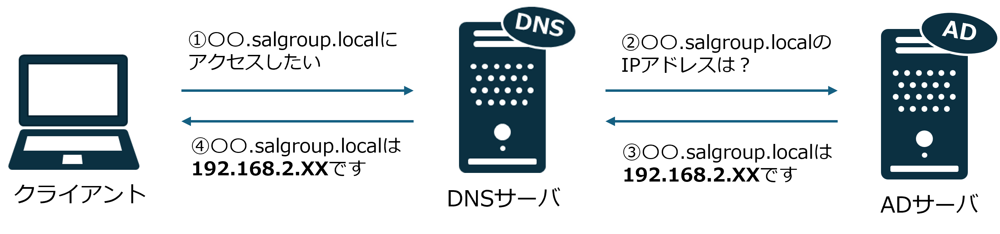</div><br><br>
- 管理PCで下記コマンドを実行することで"salgroup.local"の名前解決ができることがわかる
  ```
  nslookup ad.salgroup.local
  ```
  ```
  nslookup fs.salgroup.local
  ```
- ここからはユーザ作成及び管理PCのドメイン参加、適切な権限付与を行う。


## ADサーバでのドメインユーザ(example)作成


- ログインしたADサーバでドメインユーザ（example）を作成する
    - 設定手順-ドメインユーザ作成
        1. 構築PCでProxmoxの管理画面に接続し、ADの仮想マシンのコンソールを立ち上げる<br><br>

        1. ADサーバに以下のユーザ名、パスワードでログインする
            - ユーザ名：Administrator(ローカルユーザ)
            - パスワード:Passw0rd!<br><br>

        1. 「スタートボタン（windowsマーク）」をクリックし、「サーバマネージャー」を選択する
          <div class="image scale30">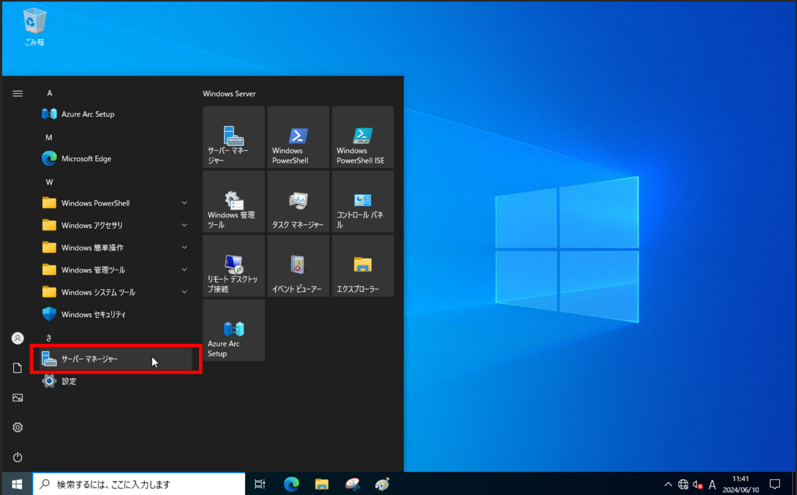</div><br><br>

        1. 表示されたウインドウの右上の「ツール」をクリック<br><br>
        
        1. 「Active Directory ユーザーとコンピューター」をクリック<br><br>
          <div class="image">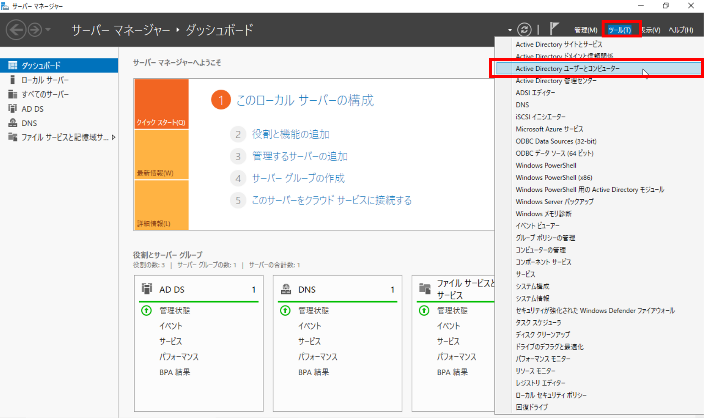</div><br><br>
        
        1. 左側のペイン内の「salgroup.local」配下の「Users」を右クリック<br><br>
        
        1. 「新規作成」をクリック後、「ユーザー」をクリック
          <div class="image scale50">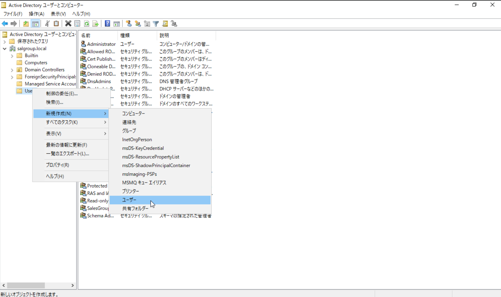</div><br><br>
        
        1. 「新しいオブジェクト-ユーザー」にて、「フルネーム」と「ユーザーログオン名」に好きな名前を入力し、「次へ」をクリック  
            - 以降、資料上では名前はexampleとして進める。exampleは各自で決めた名前に読み替えて作業を行う
          <div class="image scale50">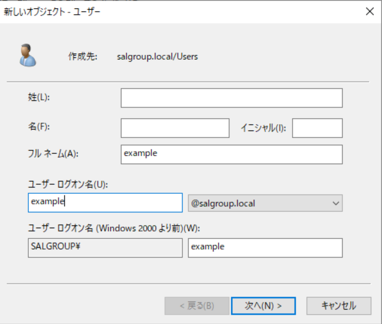</div><br><br>

        1. パスワードを確認されるので、以下のパスワードを入力  
            - パスワード：Passw0rd!<br><br>
        
        1. 「ユーザは次回ログオン時にパスワード変更が必要」のチェックは外し、「次へ」をクリック
          <div class="image scale50">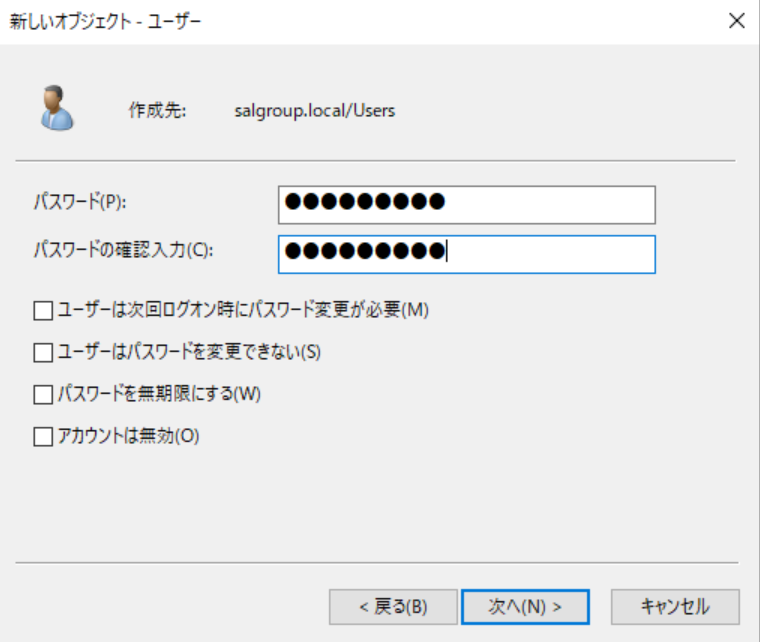</div><br><br>
        
        1. 「完了」をクリック
          <div class="image scale50">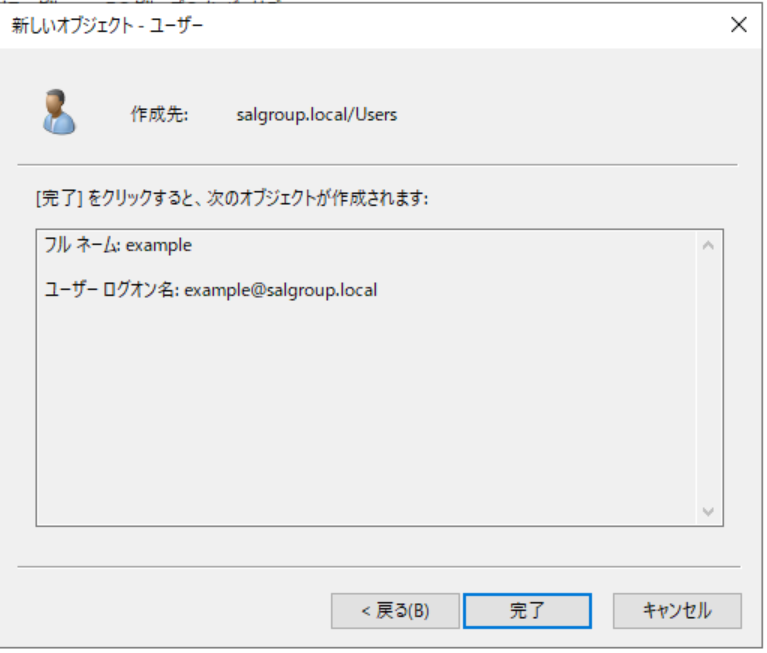</div><br><br>
        
        1. Usersを見ると、ユーザとして"example"ができていることが分かる
          <div class="image scale50">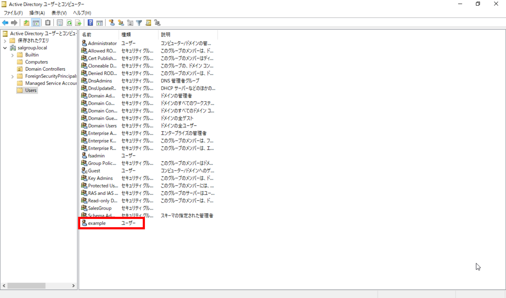</div><br><br>

## PCのドメイン参加
- ADサーバで作成した"example"ユーザで管理PCにログインできるように設定をする
    1. 管理PCにlocaladmin(ローカルユーザ)でログインする。  
      その際は以下のユーザ名、パスワードでログインする
        - ユーザ名：localadmin
        - パスワード：Passw0rd!<br><br>

    1. スタートボタン（windowsのマーク）を右クリックし、その後「システム」をクリック
    
    1. 「ドメインまたはワークグループ」をクリック
      <div class="image">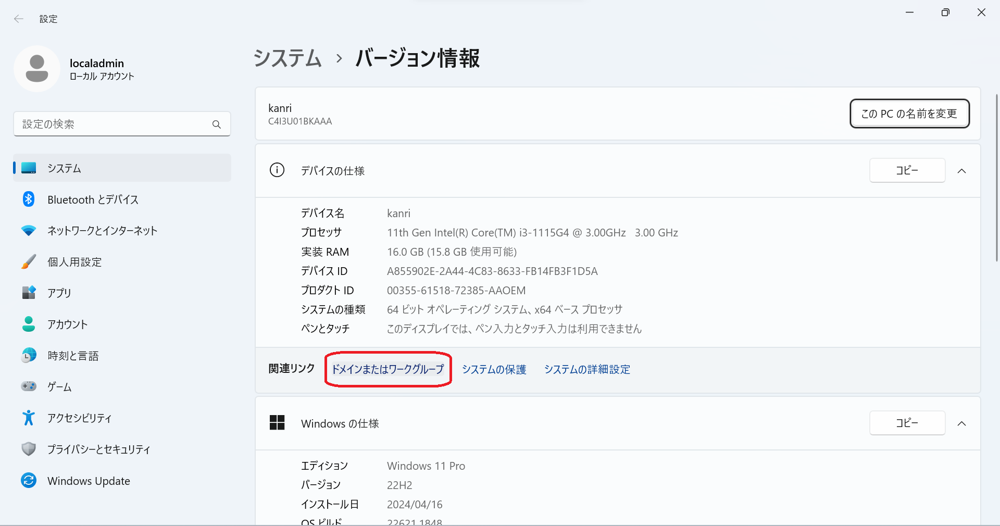</div><br><br>
    
    1. 「システムのプロパティ」にて「コンピュータ名」のタブを選択し、「変更」をクリック
      <div class="image">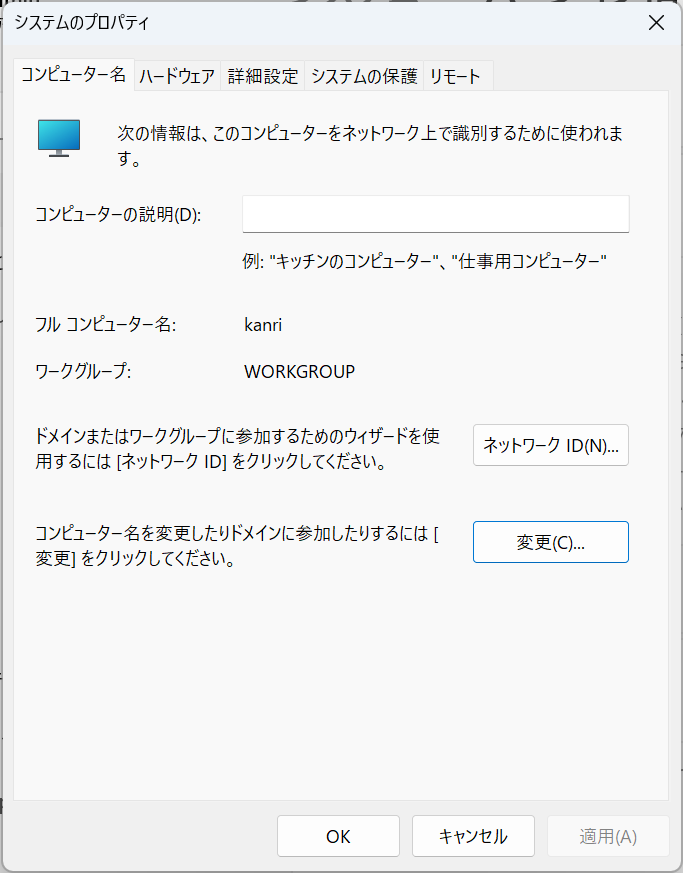</div><br><br>

    1. 「コンピュータ名/ドメイン名の変更」にて、「ドメイン」にチェックを入れる。<br>
      その後、下の入力スペースに「salgroup.local」を入力して、「OK」をクリックする<br>
      ※コンピューター名は特に変更しない
      <div class="image">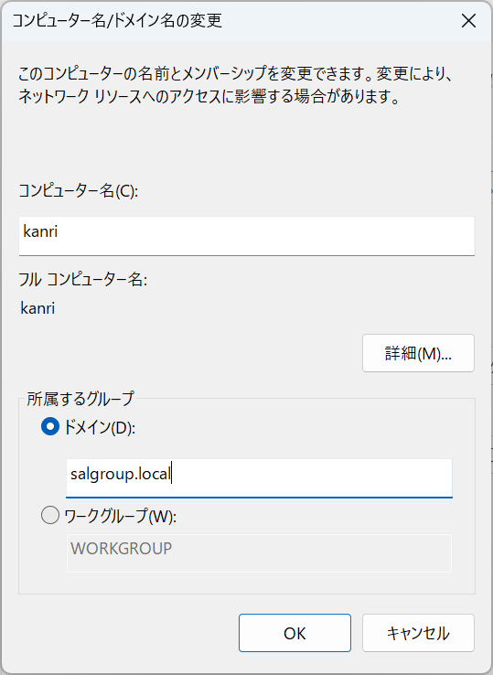</div><br><br>

    1. 「Windowsセキュリティ」のポップアップが表示されるので、以下のユーザ名とパスワードを入力する。その後、「OK」をクリック
        - ユーザ名:example
        - パスワード:Passw0rd!
          <div class="image">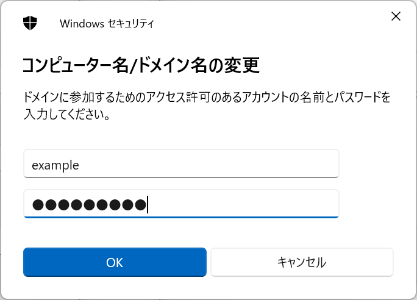</div><br><br>

    1. 「salgroup.localドメインへようこそ」と表示されるので、「OK」をクリック<br><br>
      <div class="image">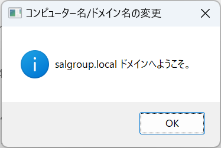</div><br><br>
    
    1. 続いて、「これらの変更を適用するには、～再起動する必要があります」と表示されるが、同じく「OK」をクリック
      <div class="image"></div><br><br>
    
    1. 「システムのプロパティ」を「閉じる」をクリックし、続いて表示される「Microsoft Windows」で「今すぐ再起動する」をクリック
      <div class="image"></div><br><br>

    1. 再起動後、ログイン画面で「他のユーザー」を選択<br><br>
    
    1. 以下のユーザ名とパスワードでログインできることを確認する
        - ユーザ名:salgroup.local\example
        - パスワード:Passw0rd!
      <div class="image">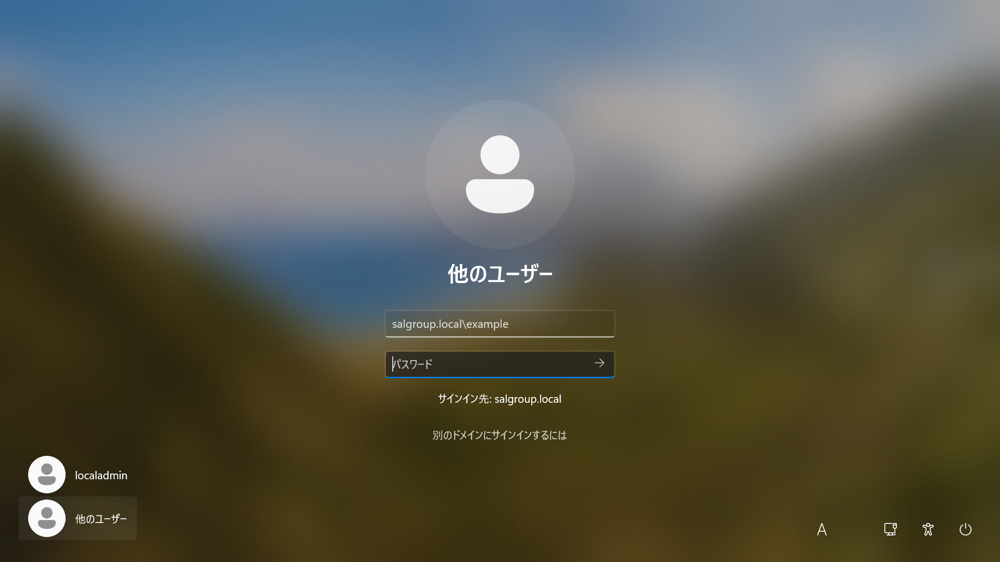</div><br><br>

    1. コマンドプロンプトにて"whoami"コマンドを入力し、ユーザ名が"salgroup¥example"と表示されていれば、ドメイン参加成功
      <div class="image">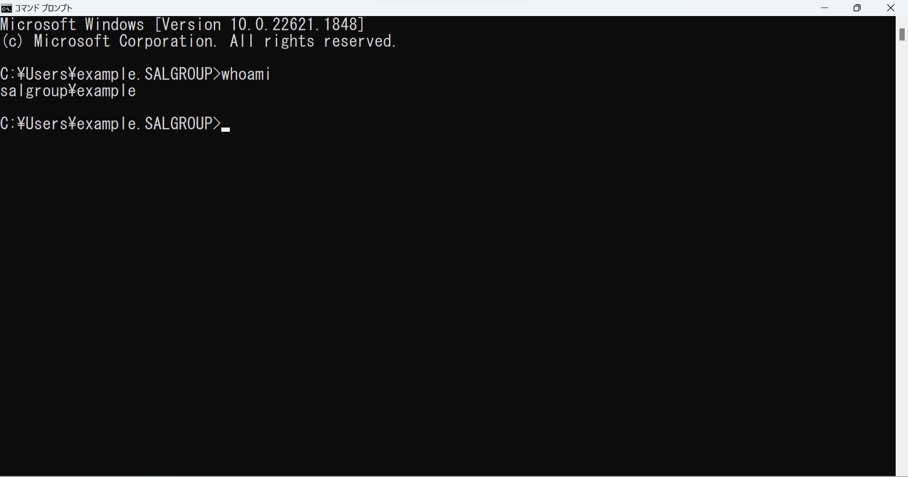</div><br><br>
    
    1. exampleを管理PCからサインアウトする。


## ドメインユーザへの権限付与
- ドメインユーザのexampleをローカルの管理者グループであるAdministratorsに追加する

    1. まずは、元々Administratorsグループに属している、ローカルユーザのlocaladminで管理PCにログインする<br>
    ※ローカルユーザにログインする場合は、ユーザ名の前に「.\」をつけること(例：.\localadmin)<br><br>

    1. スタートボタンを右クリックし、「コンピュータの管理」をクリック

    1. 「ローカルユーザーとグループ」をクリックし、「グループ」をクリック<br><br>

    1. Administratorsを右クリックし「プロパティ」を選択
      <div class="image">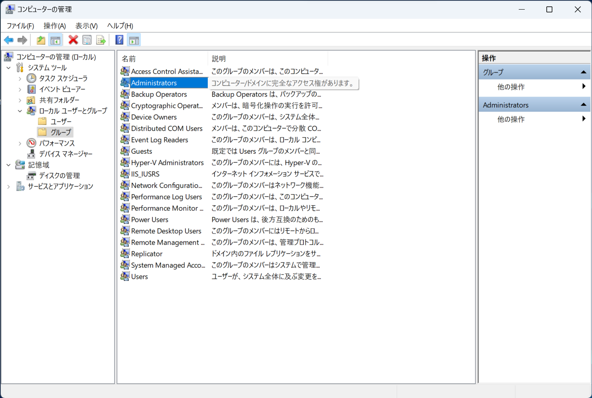</div><br><br>

    1. 下部にある「追加」をクリック
      <div class="image scale50">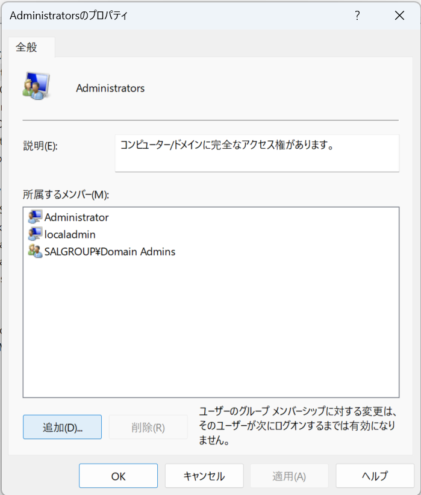</div><br><br>

    1. 「選択するオブジェクト名を入力してください」にexampleと入力
      <div class="image scale50">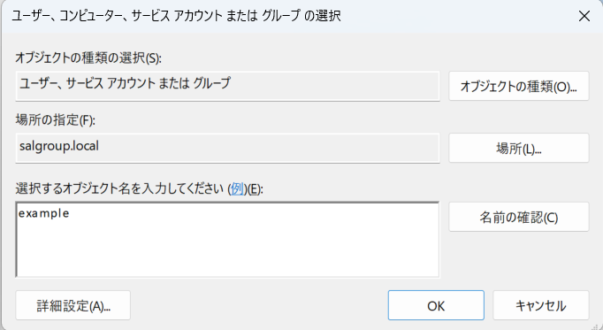</div><br><br>

    1. 「名前の確認」をクリック
      <div class="image scale50">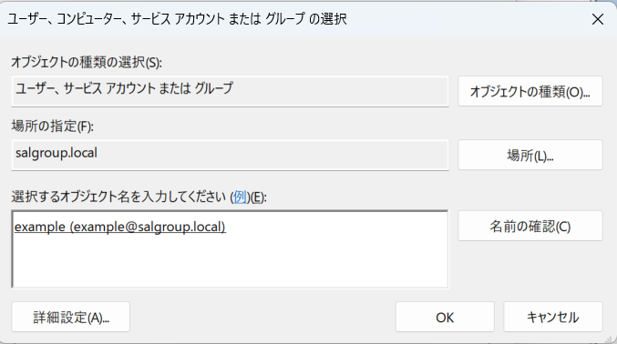</div><br><br>

    1. ネットワーク資格情報を確認されるので、以下のユーザー名とパスワードを入力し、「OK」をクリック
        - ユーザ名:example
        - パスワード:Passw0rd!
      <div class="image scale50">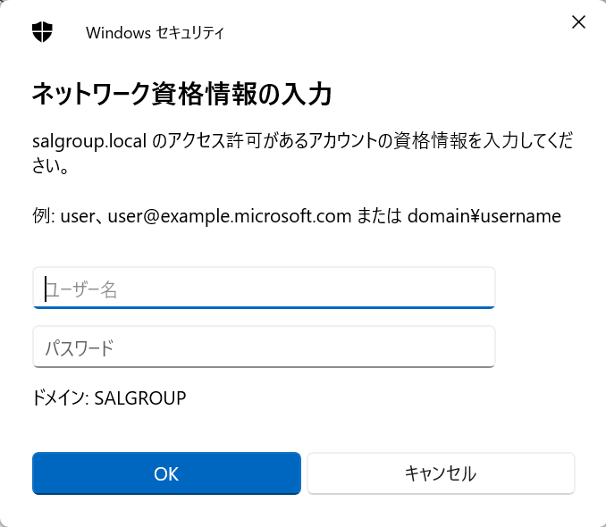</div><br><br>
      <div class="image scale50">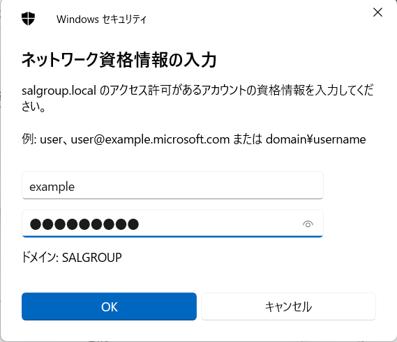</div><br><br>

    1. OKをクリック<br><br>

    1. Administratorのプロパティにexampleが追加されていることを確認し、「適用」をクリック。その後、「OK」をクリック
      <div class="image scale50">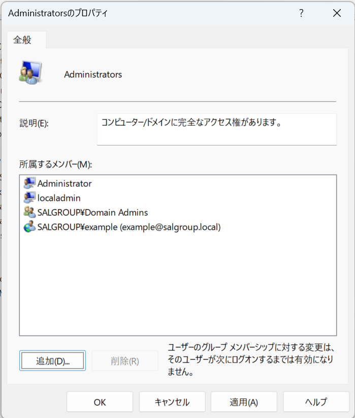</div><br><br>

    1. localadminを管理PCからサインアウトし、exampleでログインできることを確認する<br><br>  

    1. スタートをクリックし、検索バーでWindows PowerShellを入力<br><br>
    
    1. 検索結果にWindows PowerShellが表示されるので、右クリックして「管理者として実行」をクリック
      <div class="image scale50">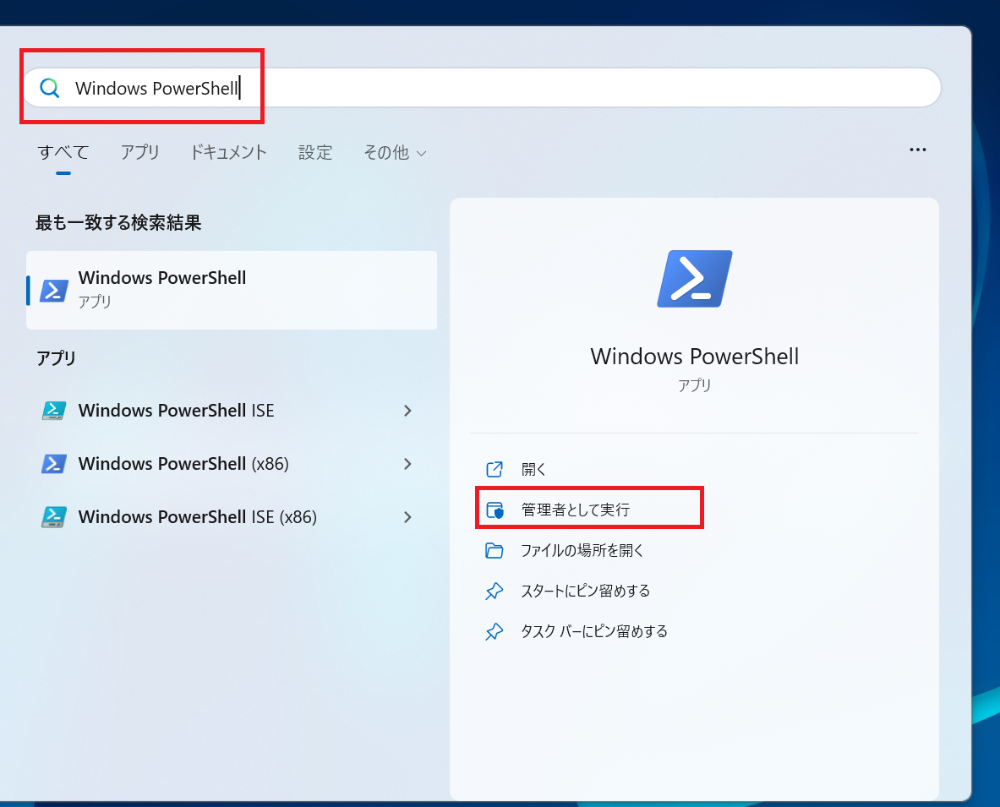</div><br><br>
    
    1. ユーザアカウント制御のポップアップが出るが、「OK」をクリックする<br><br>
    
    1. ここでパスワードを確認されずに以下のターミナルが起動すればOK
      <div class="image">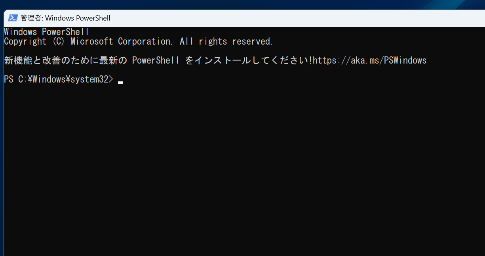</div><br><br>

## ADサーバでのドメインユーザ（kanri）作成
- ログインしたADサーバでドメインユーザ"kanri"を作成する<br><br>

- このkanriはADサーバを管理するためのユーザとして運用する想定であり、セキュリティグループのDomainAdminsに参加させることで強い権限を持たせる<br>
※DomainAdminsとはドメインの管理者を意味するセキュリティグループである<br><br>
  - 設定手順-ドメインユーザ作成
    1. ドメインユーザexampleを作成したときと同じ流れでADサーバの仮想マシンにログインする<br><br>

    1. 「スタートボタン（windowsマーク）」をクリックし、「サーバマネージャー」を選択する
        <div class="image scale30"></div><br><br>

    1. 表示されたウインドウの右上の「ツール」をクリック<br><br>
    
    1. 「Active Directory ユーザーとコンピューター」をクリック
        <div class="image"></div><br><br>
    
    1. 左側のペイン内のsalgroup.local配下のUsersを右クリック<br><br>
    
    1. 新規作成をクリック後、ユーザーをクリック
        <div class="image"></div><br><br>
    
    1. 新しいオブジェクト-ユーザーにて、フルネームとユーザーログオン名に”kanri”を入力し、次へをクリック
        <div class="image scale50">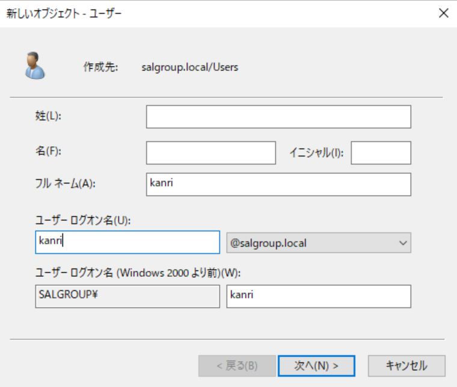</div><br><br>

    1. パスワードを確認されるので、"Passw0rd!"を入力<br>
    「ユーザは次回ログオン時にパスワード変更が必要」のチェックは外し、次へをクリック<br><br>
    
    1. 完了をクリック<br><br>
    
    1. Usersを見ると、ユーザとしてkanriができていることが分かる
        <div class="image scale50">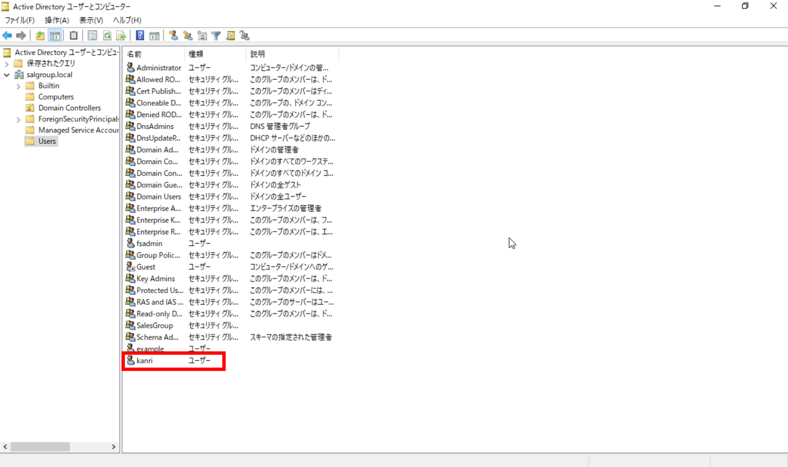</div><br><br>

  - 設定手順-kanriにドメイン管理者権限を付与
    1. 引き続きADサーバを操作し、Usersのkanriを右クリック<br><br>

    1. プロパティをクリックし、kanriのプロパティが出てくる<br><br>

    1. kanriのプロパティから所属するグループをクリック
        <div class="image scale50">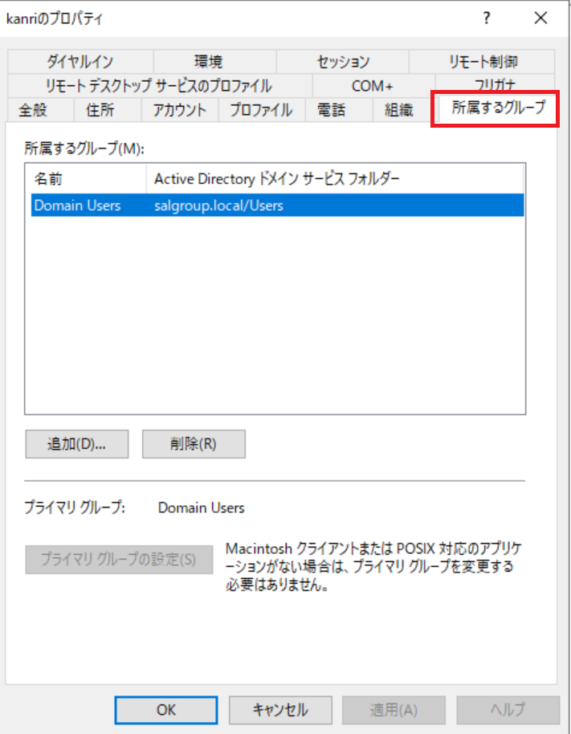</div><br><br>

    1. 追加をクリック<br><br>

    1. 選択するオブジェクトを入力してくださいに”Domain Admins”と入力し、名前の確認をクリック
        <div class="image scale50">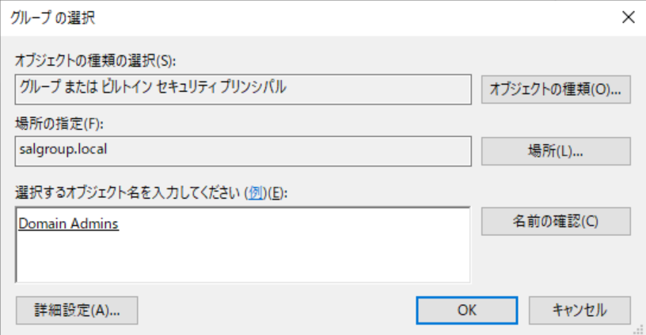</div> <br><br>

    1. OKをクリック<br><br>

    1. kanriのプロパティで所属するグループにDomain Adminsが追加されていることが分かる
        <div class="image scale50">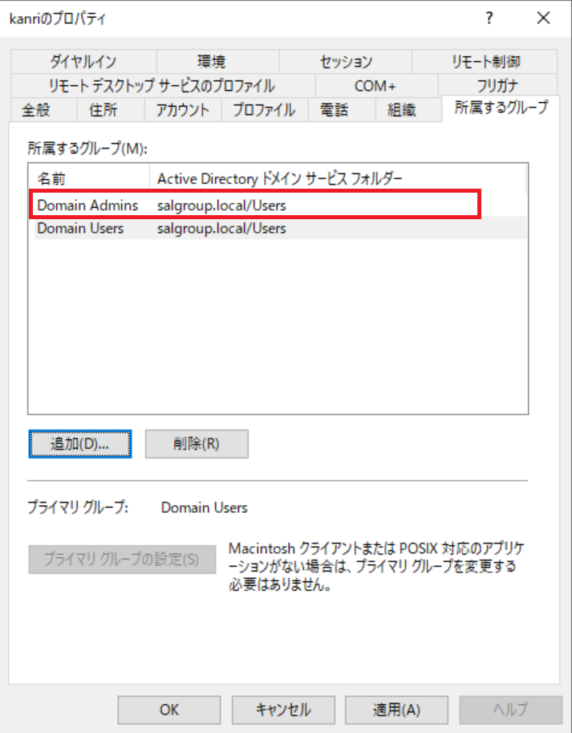</div> <br><br>

    1. OKをクリック<br><br>

    1. exampleを管理PCからサインアウトし、kanriでログインする<br><br>

    1. スタートをクリックし、検索バーでWindows PowerShellを入力<br><br>

    1. 検索結果にWindows PowerShellが表示されるので、右クリックして管理者として実行をクリック
        <div class="image scale50"></div><br><br>

    1. ユーザアカウント制御のポップアップが出るが、OKをクリックする<br><br>

    1. ここでパスワードを確認されずに以下のターミナルが起動すればOK
        <div class="image"></div><br><br>

