<link rel="stylesheet" href="/public/css/markdown-common.css">

システム構築演習（ファイルサーバー）
============================

# ファイルサーバーとは
ファイルサーバーは、同一ネットワーク上でファイルを共有するためのサーバーです。<br>
利点として、PC同士でのファイル共有が簡単になること、フォルダ・ファイルへのアクセス権の付与が挙げられます。
<div class="image">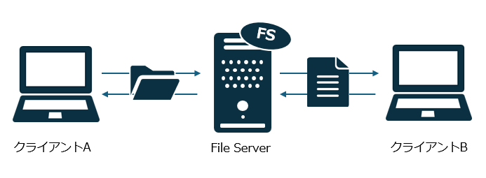</div>

ドメインに参加しているファイルサーバーは、ドメインユーザーやドメイングループごとにアクセス権を設定することができます。<br>
これにより、ITシステム部は〇〇フォルダにアクセス可能、✕✕フォルダにはアクセス不可といった制限が可能です。

# ファイルサーバーのセットアップ

<div class="image">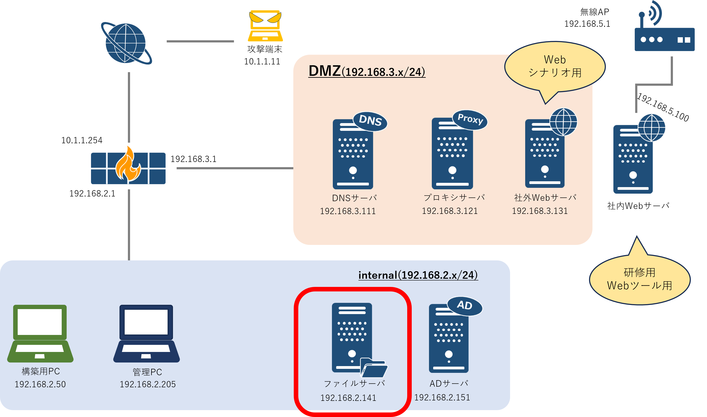</div><br>

## 前提
- 仮想マシンにWindowsServerをインストールしたのみの状態から構築を始める。
- 本研修では、ファイルサーバ機能のインストール及び共有ファイルの作成、共有設定を行う。


## ファイル共有機能の追加

1. 構築PCからProxmoxの管理画面に接続し、FSの仮想マシンのコンソールを立ち上げる<br><br>

1. サーバーマネージャーから役割と機能の追加を選択し、「役割と機能の追加ウィザード」を起動する。
    <div class="image">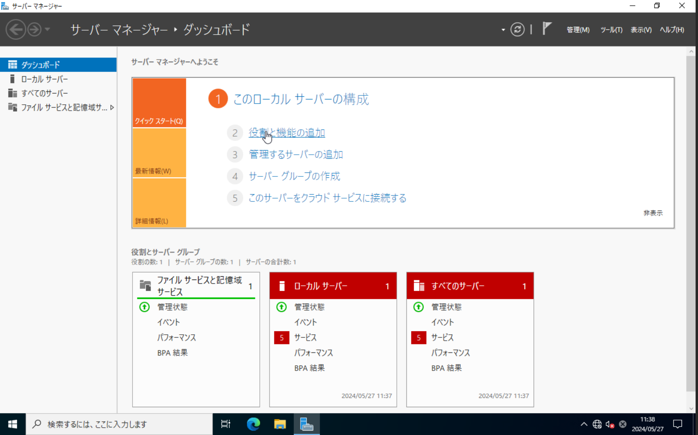</div><br><br>

1. [開始する前に]では「次へ」を選択する。
    <div class="image">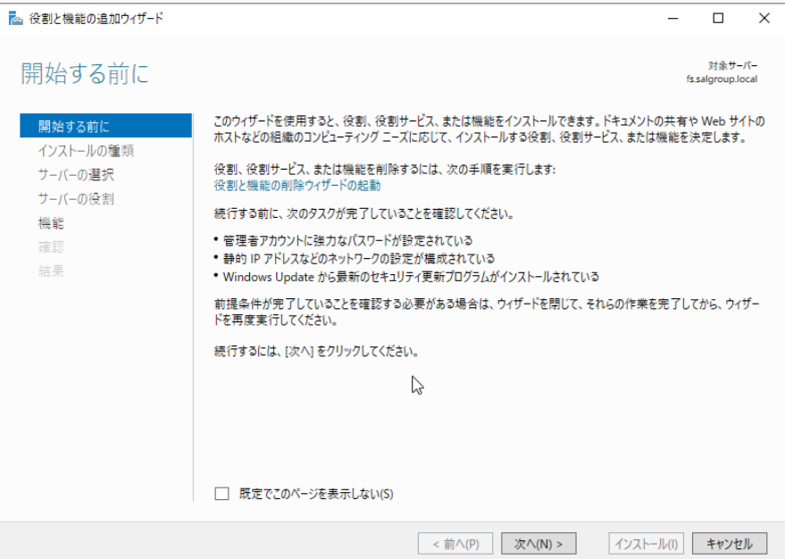</div><br><br>

1. [インストールの種類の選択]では「次へ」を選択する。
    <div class="image">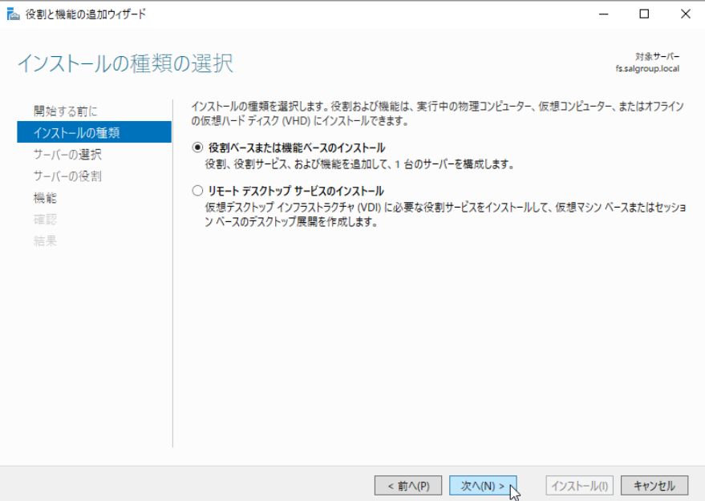</div><br><br>

1. [対象サーバーの選択]では「次へ」を選択する。
    <div class="image">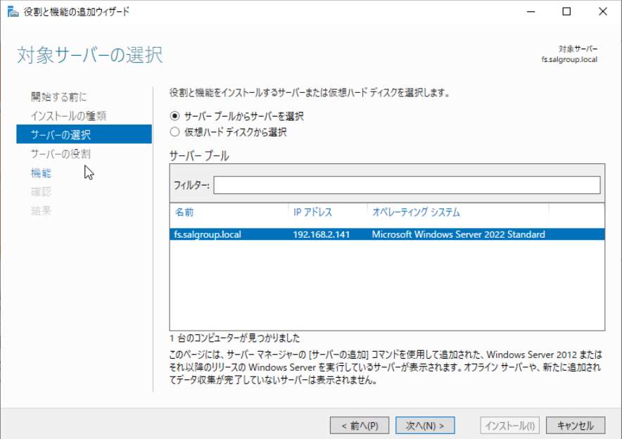</div><br><br>

1. [サーバーの役割の選択]では「ファイルサービスと記憶域サービス」->「ファイルサービスおよびiSCSIサービス」->「ファイルサーバー」を選択する。
    <div class="image">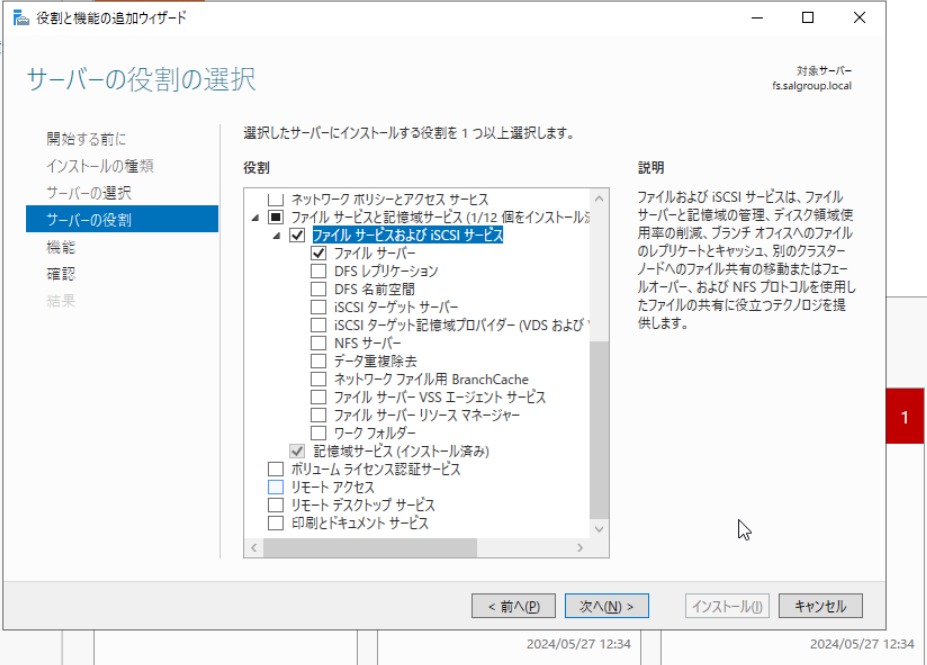</div><br><br>

1. [機能の選択]では「次へ」を選択する。
    <div class="image">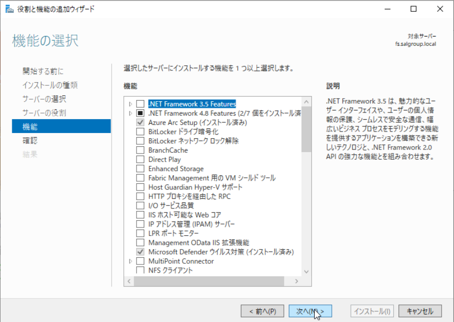</div><br><br>

1. [インストールオプションの確認]では「インストール」を選択する。
    <div class="image">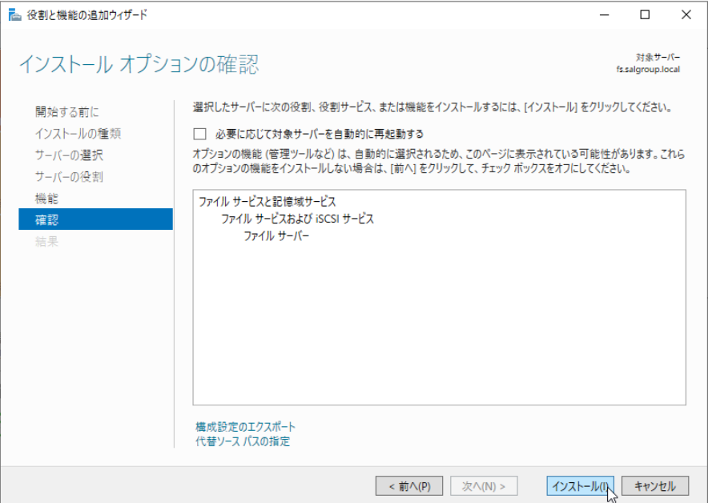</div><br><br>

1. 上記の設定が完了したら、再起動を行う。<br><br>

## 共有フォルダの設定
1. fsadminでファイルサーバーにログインする<br><br>

1. ファイルエクスプローラーを開き、Cドライブ直下に移動する。<br><br>

1. 「Share」という新しいフォルダーを作成する。<br><br>

1. 「Share」の配下に、「Share\_Folder」と「Secret\_Folder」という新しいフォルダーを作成する。<br><br>

### Share

1. Shareを右クリックし、プロパティ->「共有」タブ->ネットワークのファイルとフォルダーの共有を開き、「共有」を押す。
    <div class="image">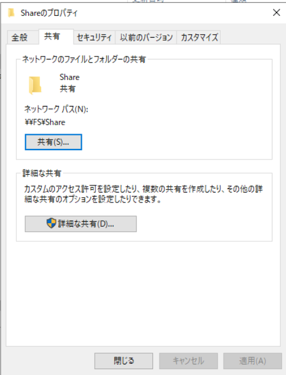</div><br><br>

1. ネットワークアクセスが起動し、入力欄に「Everyone」と入力し、「追加」を押す。その後、「アクセス許可のレベル」を「読み取り/書き込み」に変更する。最後に「共有」を押す。
    <div class="image">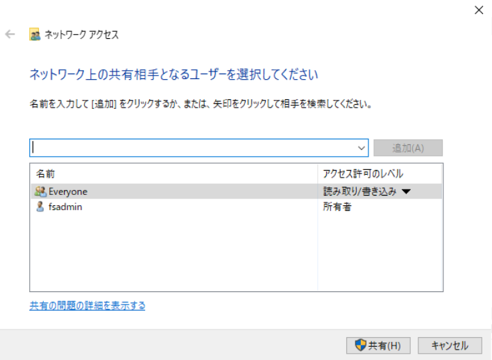</div><br><br>

### Share\_Folder

1. Share\_Folderを右クリックし、プロパティ->「共有」タブ->ネットワークのファイルとフォルダーの共有を開き、「共有」を押す。<br><br>

1. ネットワークアクセスが起動する。<br><br>

1. 「Everyone」を選択し、削除する。<br><br>

1. 、入力欄に「Domain Users」と入力し、「追加」を押す。<br><br>

1. アクセス許可のレベルを「読み取り/書き込み」に変更し、「共有」を押す。<br><br>

フォルダの中に、「公開情報.txt」というテキストファイルを作ってみましょう。<br><br>

### Secret\_Folder

Share\_Folderの設定方法にならい、ドメイン管理者のみSecret\_Folderにアクセスできるよう「Domain Admins」を追加してみましょう。<br>
フォルダの中に、「顧客情報.txt」というテキストファイルを作ってみましょう。


## 動作確認

アクセス共有の設定が正しく動作しているか、確認していきます。<br>
アカウントを切り替える時は、Windowsマークを押した後のアカウントアイコンをクリックして、**サインアウト**により切り替えてください。


### Domain Usersでログインした場合

1. AD編で作成したDomain Usersのアカウントで、管理PCにログインする。<br><br>

1. ファイルエクスプローラーを開き、アドレスバーに下記を入力し、Share\_FolderとSecret\_Folderの存在を確認する。<br><br>
    ```cmd
    \\fs.salgroup.local
    ```

1. Share\_Folderの中身が見れることを確認する。<br><br>

1. Secret\_Folderの中身が見れないことを確認する。<br><br>

### kanriでログインした場合

1. Domain Adminsのkanriで、管理PCにログインする。<br><br>

1. ファイルエクスプローラーを開き、アドレスバーに下記を入力し、Share\_FolderとSecret\_Folderの存在を確認する。<br><br>
    ```cmd
    \\fs.salgroup.local
    ```

1. Share\_Folderの中身が見れることを確認する。<br><br>

1. Secret\_Folderの中身が見れることを確認する。<br><br>