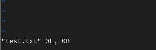
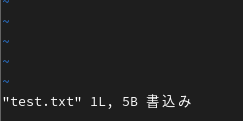

<link rel="stylesheet" href="/public/css/markdown-common.css">

## viについて
### viとは？
- UNIX系のOSで使用できるエディタソフト。ソフトウェアの設定ファイルの編集などによく使う。

### viの特徴
#### - コマンドモードとインサートモード
- viにはコマンドモードとインサートモードの2種類のモードがある
    - コマンドモード・・・テキストの保存などを行うときのモード。viコマンドでファイルを開いた直後はこのモードで開始する。
        - コマンドモードの時は、ファイルの下部分に以下のように表示される
            - 

    - インサートモード・・・テキストの編集を行うときのモード。テキストの保存をする際は１度コマンドモードに戻る必要がある。
        - コマンドモードの時は、ファイルの下部分に以下のように表示される
            - 

### viの使い方
- ファイルを開く⇒ vi ファイル名
    - 
- インサートモードに移行する⇒コマンドモードでiを押す
- 編集を終了し、コマンドモードへ移行する⇒インサートモードでescを押す
- コマンドモードで編集したファイルの保存を行う⇒：（コロン）とwを入力した後に、enterを押す
    - :wの入力例
        - 

    - enterを押した後
        - 
- 保存後にコマンドモードでファイルを閉じる⇒:（コロン）とqを入力した後に、 enterを押す
    - :qの入力例
        - 

- 保存せずにコマンドモードでファイルを閉じる⇒qと!を入力した後に、 enterを押す