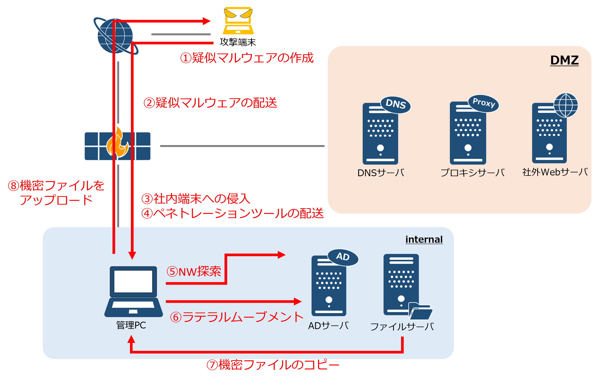

<link rel="stylesheet" href="/public/css/markdown-common.css">

※模擬攻撃の具体的内容について記載は控えさせていただきます。以下「模擬攻撃の概要」に流れを記載したので参考にしてください。

# 模擬攻撃の概要
本演習では、構築した環境に対して以下の図の流れでサイバー攻撃を行い、その動作原理を理解していきます。

 

1. 疑似マルウェアの作成

    - リバースシェルにより、管理PCと通信ができるようにする。

2. 疑似マルウェアの配送

    - 本環境では、フィッシングメールが送られた想定で配送したとする。

3. 社内への侵入

    - 1で作成したリバースシェルを使い、管理PCに侵入する。

4. ペネトレーションツールの配送

    - 管理PCへ必要なペネトレーションツールをダウンロードする。

5. NW探索

    - 同セグメントのNW調査をする。

6. ラテラルムーブメント

    - 管理PCからADサーバへ横展開する。

7. 機密ファイルのコピー

    - 管理PCにファイルサーバの機密フォルダをダウンロードし、攻撃PCへアップロードする。