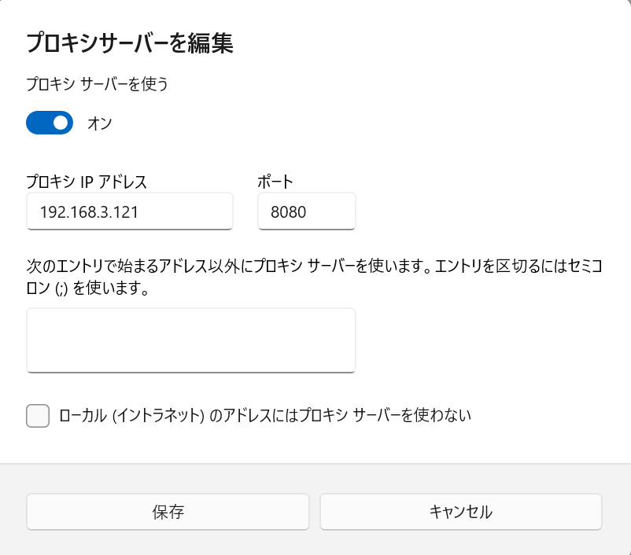

<link rel="stylesheet" href="/public/css/markdown-common.css">

対策検討
========================

# サイバーキルチェーン

- サイバーキルチェーンとは、一連のサイバー攻撃を 7つの段階ごとに分けてモデル化したものになります。

<div class="image"><br>
出典：https://is-c.panasonic.co.jp/jp/closeup/vol060.html</div>

- サイバー攻撃を各段階ごとに分析することで、サイバー攻撃をより深く理解し、防御することを目的としています。

    - 1.偵察：公開情報や、企業のウェブサイトなどから攻撃対象のシステムや、ネットワーク構造など調査する
    - 2.武器化：偵察で調査した情報をもとに攻撃ツールやマルウェアの作成・準備する
    - 3.配送：武器化で作成したツールやマルウェアをフィッシングメールや偽ウェブサイトなど様々な方法で配布する
    - 4.攻撃：ターゲットのシステムに存在する脆弱性を利用して侵入をする
    - 5.インストール：マルウェアやバックドアなどをインストールする。
    - 6.遠隔制御：インストールしたマルウェアを通じてターゲットのシステムに指令を送ります。
    - 7.目的達成：データの盗難、暗号化、流出、システムの破壊など、攻撃者の目的とした行動をとる

- 一連の攻撃をどこかで防ぐことが重要です。

# セキュリティ対策の実装
## Proxyサーバの設置
- Proxyサーバとは
    <div class="image scale50"></div>

    - 社内からのインターネットへのアクセスを代行するサーバ
    - プロキシサーバを経由することで社内端末からインターネットへの通信をログとして残すことができる→社内端末からC2サーバなど悪意あるサーバへのアクセスを検知することができる
    - プロキシサーバを経由しない通信をファイアウォールなどで遮断し、外部への通信をプロキシサーバ経由に限定することで、全ての端末のアクセスログを残すことが可能になる

### 設定手順
- 今回Proxyサーバ側は設定を完了させており、受講生側では "管理PC" のProxy設定を行う
    1. "Microsoft Edge"を開き、"・・・"のマークをクリックする
        <div class="image scale50"></div><br><br>

    1. 一覧から「設定」をクリックし、設定ページを開く<br><br>
    
    1. 「システムとパフォーマンス」をクリックする<br><br>
    
    1. 「システム」項目の「コンピューターのプロキシ設定を開く」をクリックする
        <div class="image"></div><<br><br>
    
    1. 「手動プロキシ セットアップ」の項目で「プロキシ サーバーを使う」の「セットアップ」をクリックする<br><br>
    
    1. プロキシサーバーを使うの「オフ」を「オン」にする<br><br>
    
    1. その他の設定は以下の通りに入力する
        - プロキシ IP アドレス：192.168.3.121
        - ポート：8080
        <br><br>
    
    1. 「保存」をクリック
        <div class="image scale50"></div><br><br>

### 確認手順
- proxyサーバでログを確認する
    1. "構築PC" で、proxmox にログインする。<br><br>
    
    1. 「121(proxy)」の「Console」を開く。<br><br>
    
    1. "proxy"ユーザーをクリックし、パスワードにPassw0rd!を入力する。
        <div class="image"></div><br><br>
    
    1. 左上の「アクティビティ」を選択し、下の「端末」をクリックする。
        <div class="image"></div><br><br>
    
    1. 「端末」から管理者権限で以下のコマンドを実行する。
        ```bash
        su
        ```
        （passwordはPassw0rd!）
        ```bash
        cd /var/log/squid
        ```
        ```
        tail -f access.log
        ```
        - `tail -f`コマンドにより、指定したファイルが更新されるとリアルタイムで更新分が表示される。<br><br>
    
    1. 管理PCで"Microsoft Edge"を開き`http://192.168.3.131`を検索する。<br><br>
    
    1. access.log の出力に、`http://192.168.3.131`にアクセスしたログが出るか確認する。
        <div class="image"></div><br><br>

## logサーバの設置
- logサーバとは
    <div class="image scale50"></div>
    
    - ※ログについて…OSログやアプリケーションログなど様々な種類のログがあり、ログ分析を行うことでインシデント発生時などの事後調査の手助けになる
    - OSログやアプリケーションログなどをlogサーバに転送・集約することでログを保全することができる
    - 攻撃者は攻撃の痕跡を消すためにログを削除することが多いため、ログサーバに集約することでログ削除のコストが上がる
    
## PCセキュリティの強化
### 設定手順
- LSA保護機能の有効化
    1. Windowsの検索バーに"gpedit.msc"を入力する<br><br>
    
    1. "グループポリシーの編集"をクリックする<br><br>

    1. 「コンピュータの構成」の"管理用テンプレート"をダブルクリックする<br><br>
    
    1. "システム"をダブルクリックする<br><br>
    
    1. "ローカルセキュリティ機関"をダブルクリックする<br><br>
    
    1. "保護されたプロセスとして実行するようにLSASSを構成します"をクリックする<br><br>
    
    1. "有効(E)"を選択する<br><br>
    
    1. 左下の"保護されたプロセスとして実行するようにLSAを構成する"を"UEFIロックなしで有効"にする<br><br>
    
    1. 再起動する<br><br>


- Windows Defenderの有効化
    1. 「Windows」ボタンを押し、"設定"を開く<br><br>
    
    1. 左項目の"プライバシーとセキュリティ"を押す<br><br>
    
    1. "Windowsセキュリティ"を押す<br><br>
    
    1. 「Windowsセキュリティを開く」を押す<br><br>
    
    1. "ウイルスと脅威の防止"をクリックする<br><br>
    
    1. "ウイルスと脅威の防止の設定"の「設定管理」をクリックする<br><br>
    
    1. "改ざん防止"をオンにする<br><br>

## その他の対策
- ウイルス対策ソフト導入
    <div class="image scale50"></div>
    
    - Endpoint Protection Platform (EPP)とは
        - パターンマッチングでウイルス対策を行う
        - 「パターンマッチング」とは、既知のマルウェアのシグネチャ（特徴的なパターン）をデータベースに登録し、システム内のファイルや動作をこれらのシグネチャと照らし合わせて比較する方法です。
        - 既知のマルウェアを迅速に検出し、除去することができます。
        <br><br>
    - Endpoint Detection and Response (EDR)とは
        - エンドポイント（PC、サーバー、モバイルデバイスなど）のセキュリティツールの一種です。EDRの主な目的は、エンドポイント上で悪意ある活動や異常な動作を検出し、迅速な対応をすることです。
        - エンドポイント上のアクティビティをリアルタイムで監視し、異常な動作や疑わしい活動を検出します
        - 脅威が検出された場合、EDRは自動的にまたは手動で対応策を講じます
        <br><br>

- 侵入検知・防御システムの導入
    <div class="image scale50"></div>
    
    - Intrusion Prevention System (IPS)とは
        - サーバーやネットワークを監視し、不正なアクセス・異常な通信があれば管理者へ通知し、通信をブロックする
    <br><br>
    - Intrusion Detection System (IDS)とは
        - IDSを設置して通信を監視し、通信に異常があれば管理者へ通知する
    <br><br>

- NWセグメントの分割
    <div class="image scale50"></div>
    <br><br>
    - 社内NW・サーバNWの分離
    - ネットワークを分割することで、NW回線全体の混雑の緩和、トラブル影響範囲の制限や、セキュリティの強化にメリットがある
    <br><br>

- FWのポリシー見直し
    - ポート制御
        - 不要なポートを閉じることで、攻撃者が悪用できる入口を減らし、システムへの侵入リスクを低減します
    <br><br>

- ユーザー権限・運用体制見直し
    - サーバ・ファイルなどへの権限見直し
    - 攻撃起点となりうる運用体制の見直し
        - 複雑なパスワードの設定
        - 多要素認証の導入
    <br><br>

- セキュリティ教育
    - メール訓練
    - インシデント対応訓練
    - E-ラーニング

# 対策検討

## 今回のサイバー攻撃を体験してみて、実施すべき対策を話し合おう

- 対策検討にあたって考慮すべきこと

    - 技術的な観点の対策はありますか？
    - 人的・組織的な観点の対策はありますか？
    - サイバー空間だけでなく、フィジカル空間の対策はありますか？
    - サイバーキルチェーンの各段階で防御・検知できることはありますか？

- セキュリティ対策には様々な方法があります。
- 攻撃を事前に防ぐための防御対策や、侵入後の検知による被害影響の軽減対策など…


## 対策検討の共有

- 対策検討の話し合いで出た意見を共有しましょう。
