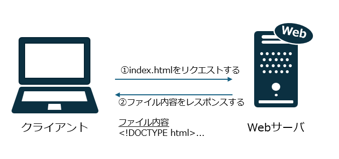
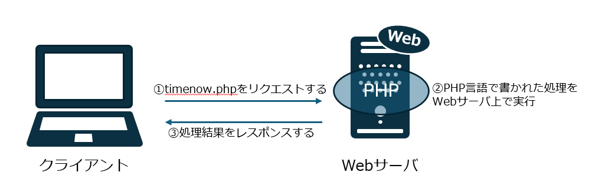
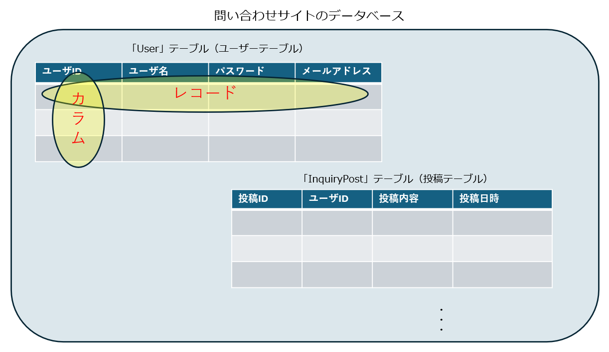
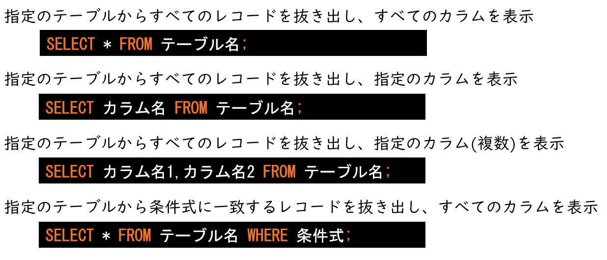
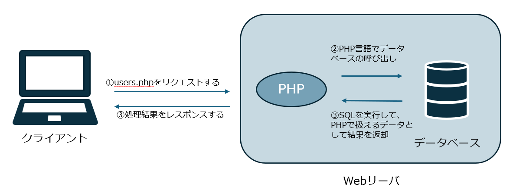

<link rel="stylesheet" href="/public/css/markdown-common.css">

Webアプリケーションの技術
=======================

本演習でWebアプリケーションを構成する要素技術について学んでいきます。

# HTML

ブラウザで表示されるWebページは、HTML(HyperText Markup Language)という言語に従って記載されています。

## ハンズオン

1. テキストエディタを開き、下記の内容をコピー＆ペーストして `index.html` という名前で保存する
    ```html
    <!DOCTYPE html>
    <html lang="ja">
    <head>
        <title>この部分はページタイトルとしてブラウザのタブに表示されます。</title>
    </head>
    <body>
        <h1>見出しです</h1>
        <p>本文です。</p>
    </body>
    </html>
    ```
1. 保存したファイルをダブルクリックで開き、ブラウザで表示する
    - ブラウザはファイルに書かれたHTMLの内容を読み込み、解釈および整形して表示する

## HTMLの構造

- `<`および`>`で囲まれた部分をタグといいます。
- 例: `<p>`、`</p>`
    - `<p>`を開始タグといい、`</p>`のように`</`で始まっているものを終了タグといいます。
    - `p` は段落を表します。
- 以下のように、開始タグから終了タグで囲まれた全体をHTMLの *要素* といいます。
    ```html
    <p>本文です。</p>
    ```
- タグによってHTMLに様々な意味や機能を持たせることができます。
    - 例
        - ``: 画像を表示 
        - `<strong>`: <strong>強調表示</strong>

# Webサーバー

先ほどのハンズオンでは、自分のPCにあるファイルをブラウザで開いて表示しました。
遠隔にあるファイルをブラウザで表示するためには、Webサーバーが必要です。

<div class="image"></div>

Webサーバーを実現するサーバー側のソフトウェアとして、 Apache HTTP Server などがあります。

処理の流れは以下のようになります。
1. WebブラウザからWebサーバーに対してリクエスト(要求)を送信する
1. WebサーバーからWebブラウザに対してレスポンス(返答)を送信する

## ハンズオン

さきほどのハンズオンで作成した `index.html` を Web サーバーに格納し、ブラウザで表示させてみましょう。

1. WinSCP を起動し、Web サーバーに接続する
    - IPアドレス: `xxx.xxx.xxx.xxx`
    - ユーザー名: `root`
    - パスワード: `password`

1. サーバーのディレクトリを `/var/www/html/tech/` に移動する
1. `index.html` を Web サーバーにアップロードする
1. ブラウザで `http://xxx.xxx.xxx.xxx/tech/index.html` を開き、表示する
    - ブラウザからサーバー(xxx.xxx.xxx.xxx)に対して、"/tech/index.html" の位置にあるファイルを要求するリクエストが送信される
    - サーバーはリクエストを解釈し、ファイルの内容がブラウザにレスポンスとして送信される
    - ブラウザはHTMLを解釈し表示する

# サーバーサイドプログラム

実際のWebでは状況に応じて表示する内容を変えることが多いです。

- 例: 検索サイト、ショッピングサイト、SNS

実現するためには、Webサーバーの中で "サーバーサイドプログラム" を動作させる必要があります。

今回のハンズオンでは PHP という言語を使用します。

WebブラウザがWebサーバにリクエストしたとき、Webサーバ上でPHPスクリプトの処理が実行され、Webブラウザに処理結果が返されます。

<div class="image"></div>

## ハンズオン

1. テキストエディタを開き、下記の内容をコピー＆ペーストして `timenow.php` という名前で保存する
    ```php
    <!DOCTYPE html>
    <html lang="ja">
    <body>
        <p>今の時刻:
        <?php
            # 現在時刻を取得して表示
            echo date('Y-m-d H:i:s');
        ?>
        </p>
    </body>
    </html>
    ```
1. WinSCP を起動し、Web サーバーに接続する
1. サーバーのディレクトリを `/var/www/html/tech/` に移動する
1. `timenow.php` を Web サーバーにアップロードする
1. ブラウザで `http://xxx.xxx.xxx.xxx/tech/timenow.php` を開き、表示する
1. 数秒経過してからリロードする
    - リロードした時に、サーバーにてPHPプログラムで現在時刻が取得され、その結果が表示される

# クライアントサイドプログラム

ブラウザで表示される内容をユーザーの操作に応じて動的に変化させるためにはクライアントサイドプログラムを使用します。クライアントサイドプログラムとしては、ほとんどの場合 JavaScript が使用されます。

フォームの内容を送信する前に確認メッセージを表示したり、複雑なマウス操作(例:地図アプリ)を実現することができます。

## ハンズオン


1. テキストエディタを開き、下記の内容をコピー＆ペーストして `index.html` という名前で保存する
    ```html
    <!DOCTYPE html>
    <html lang="ja">
    <head>
        <title>JavaScript例</title>
    </head>
    <body>
        <p>今の時刻: <span id="time"></span></p>
        <div><input id="name" placeholder="名前を入力"></div>
        <div><button id="greeting" >挨拶する</button></div>
        <div style="margin-top: 4em">
            <span id="rotate" style="display:inline-block; border: 1px solid black; background-color: white">クリックで回転します</span>
        </div>
        <script>
            window.onload = function() {
                const greeting = document.getElementById("greeting");
                const name = document.getElementById("name");
                greeting.addEventListener("click", function() {
                    window.alert("こんにちは、" + name.value + "さん!")
                });
                const time = document.getElementById("time");
                setInterval(function() {
                    const now = new Date()
                    time.textContent = now.toLocaleDateString("ja-jp") + " " + now.toLocaleTimeString("ja-jp"); 
                }, 250);
                const rotate = document.getElementById('rotate');
                rotate.addEventListener('click', (e) => {
                    const keyframe =  [
                        {transform: 'rotate(0deg)'},
                        {transform: 'rotate(360deg)'}
                    ];
                    const timing = {
                        duration: 1000,
                    };
                    e.target.animate(keyframe, timing);
                });
            }
        </script>
    </body>
    </html>
    ```
1. 保存したファイルをダブルクリックで開き、ブラウザで表示する


# データベース

データベースは、情報を表の形で整理して保存するためのものです。

データベースは以下の要素で構成されています。
- テーブル(表)
    - レコード(行)
    - カラム(列)

問い合わせサイトであれば、ユーザーテーブル、投稿テーブルなどが存在します。

<div class="image"></div>

# SQL

データベースを読み取ったり書き込んだりするためにはSQL(Structured Query Language)という言語を使用します。

ここではもっとも頻繁に利用する SELECT 文について説明します。

<div class="image"></div>

## ハンズオン

1.  SQLテスト用ページ(http://xxx.xxx.xxx.xxx/tech/sql_execute.php)を開く
1. 以下の内容を入力する
    - `show tables;`
        - データベースに存在するテーブルの一覧を表示する
    - `select * from User;`
        - User テーブルにある全てのレコードについて、全てのカラムが表示される
    - `select username,mail_address from User;`
        - User テーブルにある全てのレコードが表示されるが、カラムは username と mail_address のみ表示される
    - `select * from User where id = 2;`
        - User テーブルにあるレコードから、idカラムが2であるレコードを検索し、全てのカラムを表示する
    - `select * from User where password = 'password123';`
        - User テーブルにあるレコードから、passwordカラムが`password123`であるレコードを検索し、全てのカラムを表示する

## 補足

その他のSQL

- insert: テーブルにレコードを追加する
- delete: テーブルからレコードを削除する
- update: テーブルにある既存のレコードの内容を更新する
- drop: テーブルやデータベースを削除する

# サーバーサイドプログラム(PHP)とデータベースの連携

サーバーサイドプログラム(PHP)とデータベースを連携させることで、
データベースに保存されたユーザー情報や他の情報を取り出し、表示したり処理したりできます。

<div class="image"></div>

1. テキストエディタを開き、下記の内容をコピー＆ペーストして `users.php` という名前で保存する
    ```php
    <!DOCTYPE html>
    <html lang="ja">
    <head>
        <title>ユーザー一覧</title>
    </head>
    <body>
    <h2>ユーザー一覧</h2>
    <?php
        // データベースに接続
        $host = 'localhost';
        $dbname = 'your_database';
        $username = 'root';
        $password = 'Passw0rd!';
        
        try {
            $pdo = new PDO("mysql:host=$host;dbname=$dbname;charset=utf8mb4", $username, $password);
            $pdo->setAttribute(PDO::ATTR_ERRMODE, PDO::ERRMODE_EXCEPTION);
        } catch (PDOException $e) {
            die("Could not connect to the database $dbname :" . $e->getMessage());
        }

        // SQLクエリを実行
        $sql_query = "SELECT * FROM User";
        $stmt = $pdo->query($sql_query);

        // 実行されたSQLクエリを表示
        echo "<h2>実行されたSQLクエリ</h2>";
        echo "<p>" . htmlspecialchars($sql_query) . "</p>";

        // 実行結果を表形式で表示
        echo "<h2>実行結果</h2>";
        echo "<table border='1'>";
        echo "<tr>";
        for ($i = 0; $i < $stmt->columnCount(); $i++) {
            $columnMeta = $stmt->getColumnMeta($i);
            echo "<th>" . htmlspecialchars($columnMeta["name"]) . "</th>";
        }
        echo "</tr>";
        while ($row = $stmt->fetch(PDO::FETCH_ASSOC)) {
            echo "<tr>";
            foreach ($row as $value) {
                echo "<td>" . htmlspecialchars($value) . "</td>";
            }
            echo "</tr>";
        }
        echo "</table>";
    ?>
    </body>
    </html>
    ```

1. WinSCP を起動し、Web サーバーに接続する
1. サーバーのディレクトリを `/var/www/html/tech/` に移動する
1. `users.php` を Web サーバーにアップロードする
1. ブラウザで `http://xxx.xxx.xxx.xxx/tech/users.php` を開き、表示する
    - テーブルの内容が表示される

# サーバーサイドプログラム(PHP)におけるユーザー入力受け取り

実際のWebアプリケーションでは、ユーザーの入力内容に対する処理を行う必要があります。

- 例:
    - 検索エンジン(検索文字列)
    - ユーザー登録(名前、パスワード、メールアドレスetc...)
    - SNSへの書き込み(投稿内容)


## ハンズオン

1. テキストエディタを開き、下記の内容をコピー＆ペーストして `get.php` という名前で保存する
    ```php
    <!DOCTYPE html>
    <html lang="ja">
    <body>
    <form action="" method="get">
        <input type="text" name="name">
        <input type="submit" value="送信">
    </form>
    <?php
        # ユーザーの入力内容を受け取る
        $name = $_GET["name"];
        # 値があるかどうかで分岐
        if ($name) {
            # 値がある場合は出力
            echo "こんにちは、" . $name . "さん！";
        } else {
            # 値がない場合はエラーメッセージを出力
            echo "名前が入力されていません。";
        }
        
    ?>
    </body>
    </html>
    ```

1. WinSCP を起動し、Web サーバーに接続する
1. サーバーのディレクトリを `/var/www/html` に移動する
1. `get.php` を Web サーバーにアップロードする
1. ブラウザで `http://xxx.xxx.xxx.xxx/tech/get.php` を開き、表示する
1. 名前を入力して送信する
    - 送信した後のURLを確認する

ブラウザのアドレスバーに表示されるURLに着目すると、
`http://xxx.xxx.xxx.xxx/tech/get.php?name=Taro` のようにユーザーが入力された内容が反映されています。

URLのうち`?`以降の部分(`name=Taro`)の部分を `クエリパラメータ` や `クエリストリング` などと呼び、
PHPプログラムから取得することができます。

### 補足(GETとPOST)

上記のハンズオンではGETメソッドという方式でリクエストを送信しており、
この場合ユーザーの入力内容はURLの一部として渡されることになります。

このほかにPOSTメソッドという方式でリクエストを送信することもでき、
この場合ユーザーの入力内容はURLの一部ではなくリクエスト内の別の場所に格納され、サーバーに渡されることになります。

POSTメソッドはサーバー側でデータの変更(追加、更新、削除)が発生する場合に使われます。
一方GETメソッドは情報の取得や検索など、サーバでのデータ変更が発生しない場合に使われます。

# ユーザー入力に応じたデータベース操作

ここまでの内容を用いて、ユーザーの入力内容に応じてデータベースを操作するプログラムを動かしてみましょう。

## ハンズオン

1. テキストエディタを開き、下記の内容をコピー＆ペーストして `password_check.php` という名前で保存する
    ```php
    <!DOCTYPE html>
    <html lang="ja">
    <body>
    <form method="post">
        Mail address: <input type="text" name="mail_address"><br>
        Password: <input type="password" name="password"><br>
        <button type="submit">ログイン</button>
    </form>
    <div>
    <?php
        # データベースサーバーのホスト名
        $host = 'localhost';
        # データベース名
        $dbname = 'your_database';
        # データベースに接続するためのユーザー名とパスワード
        $username = 'root';
        # 
        $password = 'Passw0rd!';

        try {
            $pdo = new PDO("mysql:host=$host;dbname=$dbname;charset=utf8mb4", $username, $password);
            $pdo->setAttribute(PDO::ATTR_ERRMODE, PDO::ERRMODE_EXCEPTION);
        } catch (PDOException $e) {
            die("Could not connect to the database $dbname :" . $e->getMessage());
        }
        $check_success = false;
        if ($_SERVER["REQUEST_METHOD"] == "POST" && isset($_POST['mail_address'], $_POST['password'])) {
            $mail_address = $_POST['mail_address'];
            $password = $_POST['password'];
            $query = "SELECT * FROM User WHERE mail_address = '" . $mail_address . "'";
            $row = $pdo->query($query)->fetch(PDO::FETCH_ASSOC);
            if ($row) {
                if ($row['password'] == $password) {
                    $check_success = true;
                }
            }
        }
        if ($check_success) {
            echo "パスワード確認成功";
        } else {
            echo "パスワード確認失敗";
        }
    ?>
    </div>
    </body>
    </html>
    ```

1. WinSCP を起動し、Web サーバーに接続する
1. サーバーのディレクトリを `/var/www/html/tech/` に移動する
1. `password_check.php` を Web サーバーにアップロードする
1. ブラウザで `http://xxx.xxx.xxx.xxx/tech/password_check.php` を開き、表示する
1. メールアドレス、パスワードを入力し送信する
    - 正しい場合と間違った場合の両方のパターンを試す
    - メールアドレス、パスワードを確認するには、SQLテスト用ページ(http://xxx.xxx.xxx.xxx/tech/sql_execute.php) にて、Userテーブルの内容を表示する
