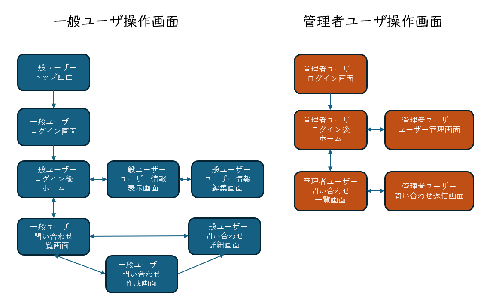

<link rel="stylesheet" href="/public/css/markdown-common.css">

Webアプリケーションの構成把握
=======

本演習では、「Webアプリケーションの技術」で学習した要素技術を使用して、様々な機能が実装されたWebアプリケーション（問い合わせサイト）の構成を把握します。

# Webアプリケーションの概要

ここでは利用するWebアプリケーションの画面構成や機能について説明をします。

構築するWebアプリケーションは以下のような機能・画面で構成されます。一般ユーザがログインを行い問い合わせを行うと、管理者はその問い合わせに対して返信が行えるようなサイトです。

ユーザには以下の２種類が存在し、それぞれ操作可能な内容が異なります。

- 一般ユーザ
    - 新規問い合わせを作成してメッセージの送信が可能
    - 自組織の問い合わせのみを参照可能
    - 自身のユーザ情報のみを参照・更新可能
- 管理ユーザ
    - 全問い合わせが閲覧可能
    - 問い合わせに対してのメッセージの返信が可能
    - 全ユーザ情報を参照・更新可能

# データベースの構成

次に、説明したアプリケーションを実現するためのデータベース構成について説明します。

今回のWebアプリケーションは以下の４つのテーブルで構成します。

1. Userテーブル
    - サイトを利用するユーザが登録されたテーブルです。
    - 管理者ユーザと一般ユーザは同じテーブルに登録されます。
    - テーブルの初期状態は以下の通りです。
        <!-- 表は図にした表がレイアウトが整いそう -->
    - ※ 本来はパスワードはハッシュ化した上で保存する必要がある

| **id** | **username**     | **password**    | **organization\_id** | **mail\_address**       | **is\_admin** |
|-------|-------------------|-----------------|---------------------|------------------------|--------------|
|   1   | 田中 太郎         | password123     |               1     | tanaka@example.com    |        0     |
|   2   | 鈴木 一郎         | password456     |               2     | suzuki@example.com    |        0     |
|   3   | 佐藤 恵子         | password789     |               1     | sato@example.com      |        1     |

2. Organizationテーブル
    - サイトを利用する組織が登録されたテーブルです。
    - テーブルの初期状態は以下の通りです。

| **id** | **secret\_key** | **orgname**     |
|-------|----------------|-------------------|
|   1   | sk12345        | 株式会社A         |
|   2   | sk67890        | 株式会社B         |
|   3   | skabcde        | 株式会社C         |

3.  Inquiryテーブル
    - 一般ユーザによる新規問い合わせが登録されるテーブルです。
    - ユーザが新規問い合わせを行った際にレコード（行）が追加されます。
    - テーブルの初期状態は以下の通りです。

| **id** | **title**                                | **user\_id** | **created\_date**        | **deleted** |
|-------|------------------------------------------|-------------|-------------------------|-------------|
|   1   | 製品についての問い合わせ             |       1     | 2024-05-10 11:11:57     |       0     |
|   2   | サービス改善提案                     |       2     | 2024-05-10 11:11:57     |       0     |

4. InquiryPostテーブル
    - 全ユーザの投稿メッセージが登録されるテーブルです。
    - ユーザがメッセージの投稿を行った際にレコード（行）が追加されます。
    - テーブルの初期状態は以下の通りです。

| **id** | **inquiry\_id** | **user\_id** | **message**                                          | **created\_date**        | **deleted** |
|-------|----------------|-------------|------------------------------------------------------|-------------------------|-------------|
|   1   |          1     |       1     | 製品の機能について質問があります。                     | 2024-05-10 11:11:57     |       0     |
|   2   |          1     |       1     | 特定の操作方法を教えてください。                       | 2024-05-10 11:11:57     |       0     |
|   3   |          2     |       2     | サービスに関して改善提案があります。                   | 2024-05-10 11:11:57     |       0     |

画面上のユーザー操作によって、各テーブルの情報を必要に応じて取得させるサーバーサイドプログラム(PHP)を実装することで、各機能を実現させています。

# Webアプリケーションの操作

ここからは説明したアプリケーションを操作して、実際にどのような動作をしているのかを見ていきましょう。

## ハンズオン

- SQLテスト用ページ(http://xxx.xxx.xxx.xxx/tech/sql_execute.php)を開いておきます。
    - SQLを入力してテーブルを確認する際に使用してください。

- 一般ユーザ操作
    1. 事前に、データベースに登録されているユーザ情報をSQLを使って表示し、一般ユーザのメールアドレスおよびパスワードを確認しておきます。(SQLテスト用ページ使用)
    1. ブラウザで `http://xxx.xxx.xxx.xxx/index.html` を開きます。
    1. 「02.Webアプリケーションの構築 & 03.Webアプリケーションの脆弱性」をクリックします。
    1. 「ログインページへ」をクリックしてサイトのログイン画面を表示します。
    1. 一般ユーザのメールアドレスおよびパスワードを入力してログインします。
    1. サイトを操作して、機能に慣れてみましょう。
        - ログイン後、ユーザ情報を表示し、ログイン者の情報が表示されていることを確認します。
        - 「問い合わせ一覧」→「新規作成」を実行すると「Inquiry」テーブルにレコードが追加されることを確認します。(SQLテスト用ページ使用)
        - メッセージを投稿すると「InquiryPost」テーブルにレコードが追加されることを確認します。(SQLテスト用ページ使用)

- 管理ユーザ操作
    1. 事前に、データベースに登録されているユーザ情報をSQLを使って表示し、管理ユーザのメールアドレスおよびパスワードを確認しておきます。(SQLテスト用ページ使用)
    1. ブラウザで `http://xxx.xxx.xxx.xxx/vuln/admin/login.php` を開きます。
        - 管理者限定で利用するページであり、直接URLを入力する以外にアクセス方法がありません。
    1. 管理ユーザのメールアドレスおよびパスワードを入力してログインします。
    1. サイトを操作して機能に慣れてみましょう。
        - 全ての問い合わせが表示されることを確認します。
        - 問い合わせの返信を行うと「InquiryPost」テーブルにレコードが追加されることを確認します。(SQLテスト用ページ使用)
        - 全てのユーザ情報が表示でき操作可能であることを確認します。