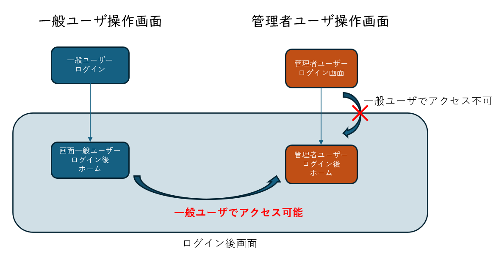
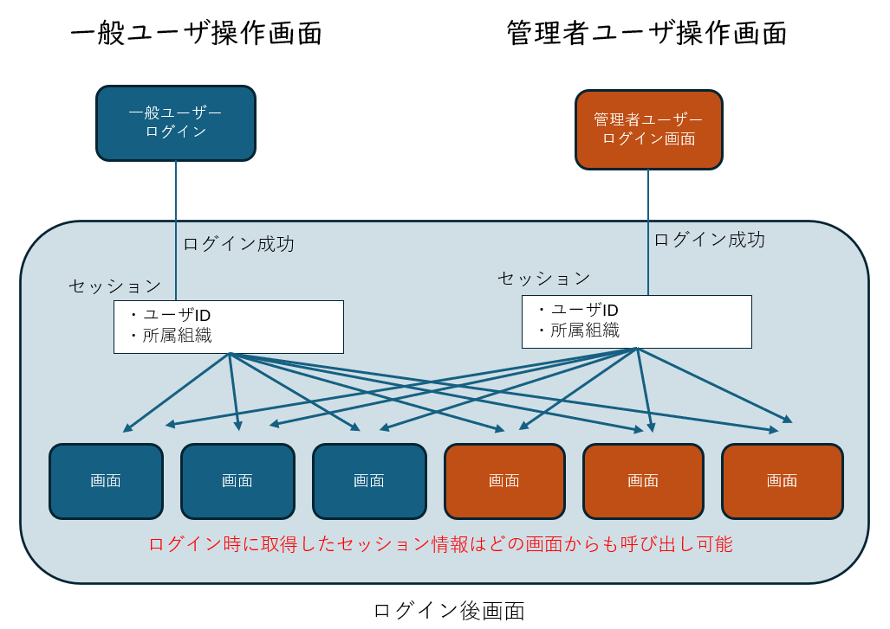
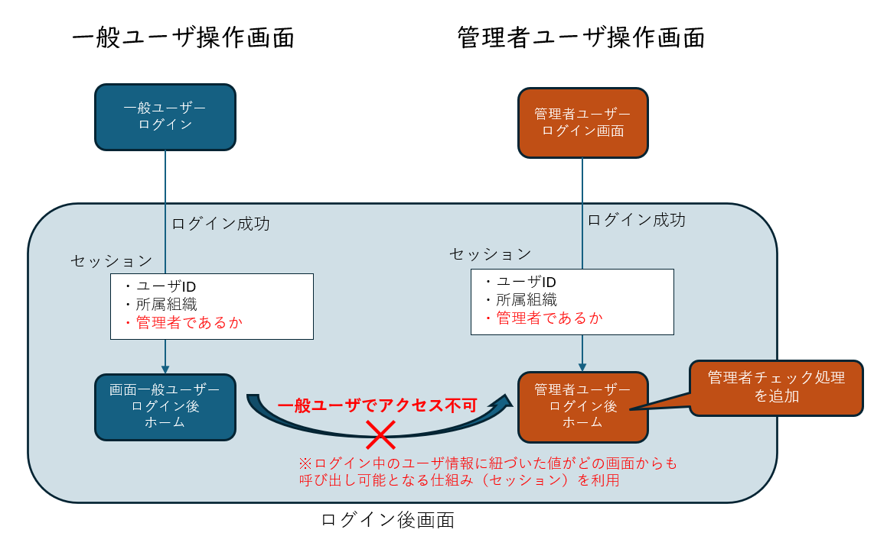
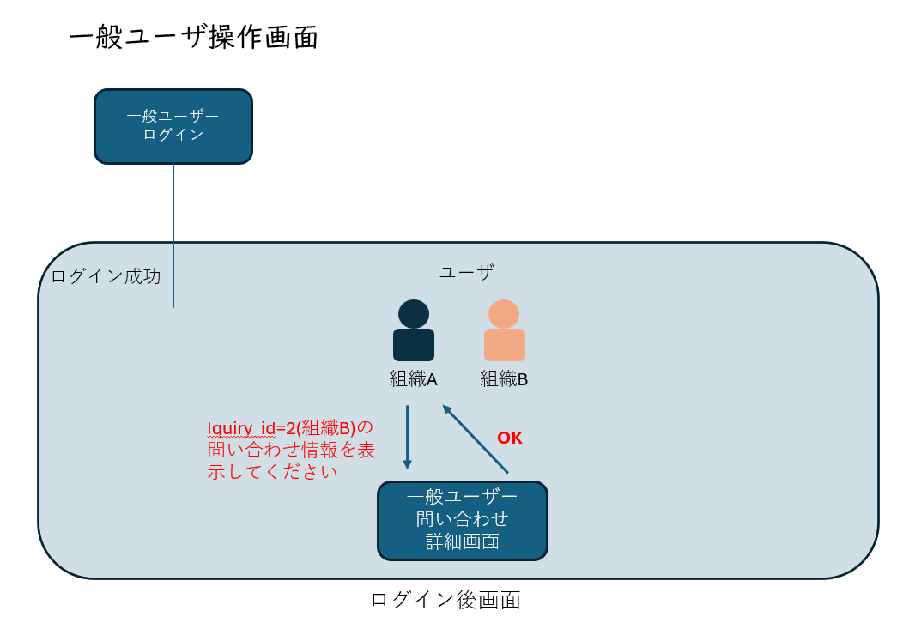
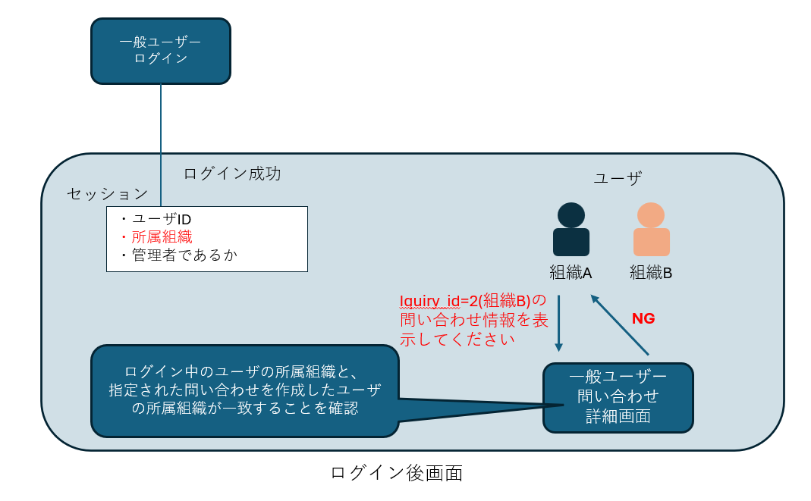

<link rel="stylesheet" href="/public/css/markdown-common.css">

Webアプリケーションの脆弱性体験
=======

本演習では、「Webアプリケーションの構成把握」で操作したWebアプリケーション（問い合わせサイト）に潜む脆弱性の危険性を体験します。

# Webアプリケーションの脆弱性について

Webアプリケーションの脆弱性は、開発工程の「設計」「コーディング」フェーズの対策不備によって作りこまれます。

今回は以下の脆弱性について紹介します。

1. アクセス制御不備
1. SQLインジェクション
1. クロスサイト・スクリプティング

# アクセス制御不備

## 原理

サイト利用者の権限(ユーザ権限・管理権限等)が存在するサイトにおいて、本来ユーザがアクセスできないリソース（データやページ等）を取得できてしまう脆弱性です。

本演習のWebアプリケーションでは、以下の操作を行うことでこの脆弱性が確認できます。

- URLの直接入力
- パラメータの改ざん

それでは早速、脆弱性を体験してみましょう。

## ハンズオン（URLの直接入力）

最初に、URLの直接入力によって権限を逸脱するアクセス制御不備の危険性を体験してみましょう。

- URLの直接入力
    1. 一般ユーザでログインを行います。
    1. トップ画面が表示された状態で、以下のURLを入力します。
        - `http://xxx.xxx.xxx.xxx/vuln/admin/top.php`
        - URLを知っていることが前提の脆弱性です。
    1. 一般ユーザで管理側の画面にアクセスできました。
        - 各機能を実行できることを確認します。

ページ表示時にログイン中のユーザ権限を確認していないことが原因で、一般ユーザが管理者ページを表示し、機能の実行までできてしまうことは非常に危険です。

<div class="image"></div>

## 脆弱性の影響（URLの直接入力）

- 機密情報への不正なアクセス
- 情報漏洩やデータの改ざん

## 対策方法（URLの直接入力）

URLを直接入力されても問題が起こらないように、ログイン中のユーザ権限をチェックするロジックをサーバーサイドプログラム(PHP)で実装します。

ユーザ毎の値をサーバ上で保持して、他の画面でもその情報を利用できる仕組みを「セッション」と呼びます。

<div class="image"></div>

　ログイン時にユーザが管理者であるかどうかという情報を取得し、他の画面でもその情報が利用できるようにし、ユーザ権限をチェックするロジックを実装します。

<div class="image"></div>

1. WinSCP を起動し、Web サーバーに接続する
    - IPアドレス: `xxx.xxx.xxx.xxx`
    - ユーザー名: `root`
    - パスワード: `password`
1. サーバーのディレクトリを `/var/www/html/vuln/admin/` に移動する
1. `login.php` を テキストエディタで開きます。
    - 以下のようにコードを修正します。(15行目付近)
        - 修正前:
        ```php
            if ($password === $row['password'] && $row['is_admin'] === 1) {
                $_SESSION['user_id'] = $row['id'];
                header("Location: ./top.php");
        ```
        - 修正後:
        ```php
            if ($password === $row['password'] && $row['is_admin'] === 1) {
                $_SESSION['user_id'] = $row['id'];
                $_SESSION['is_admin'] = $row['is_admin']; // 追加
                header("Location: ./top.php");
        ```
        - ログイン時に、ユーザが管理者であるかどうかをセッション情報として保存し、他の画面でもその情報が利用できるようにしている。

1. `top.php` を テキストエディタで開きます。
    - 以下のようにコードを修正します。
        - 以下のようにコードを修正します。(7行目付近)
            - 修正前:
            ```php
                if (!is_logged_in()) {
                    user_not_login();
                    exit;
                }
            ```
            - 修正後:
            ```php
                $login_user_is_admin = isset($_SESSION['user_id']) && $_SESSION['is_admin']; // 追加
                if (!is_logged_in() || !$login_user_is_admin) { // 変更
                    user_not_login();
                    exit;
                }
            ```
            - ユーザが管理者でない場合には処理を実行しないようにしている
1. `top.php`に加えた修正を、管理者ページのうち`login.php`以外のすべてのコードに反映させます。

## 対策の確認（URLの直接入力）

ハンズオン（URLの直接入力）の手順をもう一度実行して、脆弱性が再現されないことを確認します。

## ハンズオン（パラメータの改ざん）

次にパラメータ改ざんによるアクセス制御不備の危険性を体験します。

1. 一般ユーザでログインを行います
    - ログインページ:`http://xxx.xxx.xxx.xxx/vuln/login.php`
    - ログイン情報
        - メールアドレス：tanaka@example.com
        - パスワード：password123
1. 「問い合わせ一覧表示」をクリックします
1. 「製品についての問い合わせ」をクリックします。
1. ブラウザ上のURLが以下のようになっていることを確認します
    - `http://xxx.xxx.xxx.xxx:8000/vuln/inquiry_detail.php?inquiry_id=1`
1. クエリパラメータを以下のように変更します
    - `inquiry_id=2`
    - 一般ユーザは他のユーザの情報を確認できないですが、他のユーザの情報が表示されてしまっていることを確認します。
    - この操作によって、本来は見れないはずの他社の問い合わせ情報が取得されていることを確認します。

<div class="image"></div>

## 脆弱性の影響（パラメータの改ざん）

- 機密情報への不正なアクセス
- 情報漏洩

## 対策方法（パラメータの改ざん）

今回の場合、問い合わせIDを取得時に、その問い合わせが自組織で作成されたものであるか確認するロジックを、サーバ側(PHP)の処理で実装する必要があります。

<div class="image"></div>

1. WinSCP を起動し、Web サーバーに接続する
    - IPアドレス: `xxx.xxx.xxx.xxx`
    - ユーザー名: `root`
    - パスワード: `password`
1. サーバーのディレクトリを `/var/www/html/vuln/` に移動する
1. `inquiry_detail.php` を テキストエディタで開きます。
1. 以下のようにコードを修正します。(12行目付近)
    - 修正前:
    ```php
    $user_id = $_SESSION['user_id'];
    $inquiry_id = $_GET['inquiry_id'];
    ```
    - 修正後:
    ```php
    $user_id = $_SESSION['user_id'];
    $inquiry_id = $_GET['inquiry_id'];
    $organization_id = $_SESSION['organization_id']; // 追加
    ```
    - ログイン時に取得したユーザの組織情報を利用するための宣言をしている 
1. さらに、以下のようにコードを修正します。(19行目付近)
    - 修正前:
    ```php
    // 問い合わせ情報を取得するSQL文
    // ユーザからの入力値を直接受け付ける実装
    $stmt = $pdo->query("SELECT *FROM Inquiry WHERE id = $inquiry_id"); // この行を書き換える
    $inquiry = $stmt->fetch(PDO::FETCH_ASSOC);
    ```
    - 修正後:
    ```php
    // 問い合わせ情報を取得するSQL文
    // ユーザからの入力値を直接受け付ける実装
    $stmt = $pdo->query("SELECT *
                            FROM Inquiry
                            JOIN User ON Inquiry.user_id = User.id 
                            WHERE Inquiry.id = $inquiry_id AND User.organization_id = $organization_id"); // この4行に書き換える
    $inquiry = $stmt->fetch(PDO::FETCH_ASSOC);
    ```
    - 問い合わせを作成したユーザが所属する組織と、ログイン中のユーザの組織を比較して、一致しない場合は問い合わせが取得されないようにSQLの見直しを実施した
    - ※上記のコードには、後に説明する「SQLインジェクション」の脆弱性が残っています。
 
## 対策の確認（パラメータの改ざん）

ハンズオン（パラメータの改ざん）の手順をもう一度実行して、脆弱性が再現されないことを確認します。

# SQLインジェクション

## 原理
ユーザーからの入力を直接SQLクエリに組み込んだ場合、攻撃者は入力フィールドにSQLコマンドを挿入し、データベースに不正アクセスが可能となります。

例えば、以下のようなPHPコードを考えます。

```php
// Step 1. ユーザーがフォームに入力したメールアドレスおよびパスワードを受け取り、変数に格納する
$mail_address = $_POST['mail_address'];
$password = $_POST['password'];

// Step 2. ユーザーの入力を格納した変数を使って、クエリを構築する
//         クエリは、「メールアドレスとパスワードの両方がユーザーの入力に一致する行を抽出する」
//         ものとなっている
$sql = "
    SELECT *
    FROM User
    WHERE mail_address = '$mail_address' AND password = '$password'
";

// Step 3. クエリを実行してデータベースから結果を取得
$stmt = $pdo->query($sql);
```

上記のStep 2.について詳しく説明します。
 - PHPでは、ダブルクオーテーションで囲まれた文字列の中でPHPの変数が登場した場合、PHPの変数の内容に置き換わります。
 - 上記の例では、`$mail_address` および `$password` というPHPの変数が登場しています。
 - 例えば、`$mail_address` と `$password` にそれぞれ以下の値が格納されていたとします。
    - `$mail_address` : `suzuki@example.com`
    - `$password` : `12345678`
 - その場合、`$sql`変数は下記の値になります。
    ```sql
SELECT *
FROM User
WHERE mail_address = 'suzuki@example.com' AND password = '12345678'```
 - このSQLは、Userテーブルの中から、mail_addressカラムが`suzuki@example.com`に一致し、かつ、passwordカラムが`12345678`に一致する行を抽出します。
 - 条件を満たす行が見つかればパスワードのチェックに成功したとみなすことができます。

このコードの問題点は受け取ったクエリパラメータをそのままSQLに組み込んでいることです。

ここで、`$mail_address`変数が `'` (シングルクォーテーション1文字)だった場合はどうなるでしょうか？

以下のSQLが完成します。
```sql
SELECT *
FROM User
WHERE mail_address = ''' AND password = '12345678'
```

`mail_address = `の後にシングルクォーテーションが3つあることに注意してください。
これは、シングルクォーテーションの開閉の対応が取れていないためSQLの文法エラーとなります。

次に、`$mail_address`変数が `';--` (シングルクォーテーション1文字、セミコロン、ハイフン2文字)だった場合はどうなるでしょうか？

以下のSQLが完成します。
```sql
SELECT *
FROM User
WHERE mail_address = '';--' AND password = '12345678'
```

SQLにおいて、`;`(セミコロン)は文の区切りを意味します。また、`--`(ハイフン2文字)はそれ以降の文字列をコメントとして無視することを意味します。

まとめると、以下のSQLと等価になります。

```sql
SELECT *
FROM User
WHERE mail_address = ''
```

この場合、シングルクォーテーションの開閉の対応が取れており、文法エラーとはなりません。

実行されるSQL文は、`mail_address`カラムが空欄であるという条件で抽出する動作になります。
`mail_address`カラムが空欄の行はないため、このままでは攻撃は成立していません。

さらに手を加えて、`$mail_address`変数が`' OR id = 2;--`だった場合を考えてみましょう。

以下のSQLが完成します。
```sql
SELECT *
FROM User
WHERE mail_address = '' OR id = 2;--' AND password = '12345678'
```

コメント部分を無視すると、以下ののSQLと等価になります。
```sql
SELECT *
FROM User
WHERE mail_address = '' OR id = 2
```
実行されるSQL文は、「`mail_address`カラムが空欄である」または「`id`カラムが2である」という条件で抽出する動作になります。
`mail_address`カラムが空欄の行はありませんが、`id`カラムが2である行があり、抽出されます。パスワード一致の確認が行われていないことに注意してください。

その結果、パスワードを無視してidが2のユーザーでログインできてしまいます。

このようにユーザが入力する値にSQLを注入して、本来意図した動作と違う動作を引き起こさせる脆弱性を、SQLインジェクションと呼びます。

今回のコード例では、ユーザ入力値を変数に格納した後、単純に文字列として展開してSQL文を組み立てています。
以下のようなSQLとして意味のある文字や記号がそのまま展開されてしまうことが問題です。
- `or`
- `=` (イコール)
- `'` (シングルクォーテーション)
- `;` (セミコロン)

## ハンズオン

今回は`http://xxx.xxx.xxx.xxx/vuln/login.php`に潜むSQLインジェクションを利用して、この脆弱性の危険性を体験しましょう。

1. 一般ユーザでログインを行います。
    - ログインページ:`http://xxx.xxx.xxx.xxx/vuln/login.php`
    - ログイン情報
        - メールアドレス：`' OR id = 2;--` (シングルクォーテーション1文字から、2文字目のハイフンまで)
        - パスワード：空欄(何を入力しても成立します)
1. 「ユーザ情報表示」をクリックします。
1. パスワードを入力しなかったのにユーザーID=2のユーザーでログインできていることを確認します。

このように、SQLインジェクションが潜む場合、ユーザ入力値にSQLとして意味のある文を注入することで、開発者が意図しないデータベース操作を行うことができてしまいます。

## ハンズオン(オプション)

詳しい説明は省略しますが、SQLの`UNION`文を用いてさらに高度な攻撃ができます。

1. 一般ユーザでログインを行います。
    - ログインページ:`http://xxx.xxx.xxx.xxx/vuln/login.php`
    - ログイン情報
        - メールアドレス：tanaka@example.com
        - パスワード：password123
1. 「ユーザ情報表示」をクリックします。
1. ブラウザ上のアドレスバーにあるURLが以下のようになっていることを確認します。
    - `http://xxx.xxx.xxx.xxx/vuln/user_info.php?user_id=1`
1. クエリパラメータ`user_id`の値を変更します。
    - ブラウザのアドレスバーにあるURLのうち`http://xxx.xxx.xxx.xxx/vuln/user_info.php?user_id=`までは残します。
    - アドレスバーにあるURL末尾の`1`を削除し、`-1 UNION select User.username, User.password AS mail_address, User.organization_id AS orgname FROM User WHERE User.id = 1`に変更してください。
    - 今回は、このSQLの意味までは理解する必要はありません。
    - 本来出力されないはずの情報を取得することができたかと思います。
1. ページの変化を確認します。
    - 先ほど入力したURLのうち、最後の`1`を`2`や`3`に変えて、出力される情報が変化することを確認します。

## 脆弱性が悪用された場合に起こりうる影響
- データベース内の情報の窃取・漏洩
- データの改ざんや削除
- 個人情報や機密データが漏洩

## 対策方法

SQLインジェクションの脆弱性があるコードでは、ユーザ入力値をSQLに組み込む際、SQLとして意味のある文字や記号がそのまま展開されてしまうことが問題でした。
対策として、ユーザ入力値を処理するときに、SQLとして意味のある文字や記号はSQLとして解釈させないようにする必要があります(無害化)。具体的には以下の方法があります。

1. プリペアードステートメント
    - コード(PHP)上でSQLのテンプレートのようなものを用意します。
    - ユーザ入力値は無害化処理された上でSQLに組み込まれ実行されます。
1. ストアドプロシージャ
    - データベースであらかじめ関数のようなもの(ストアドプロシージャ)を用意します。
    - ユーザ入力値はストアドプロシージャの引数として渡すことで、データベース内で無害化処理を行った上で実行されます。

今回は「プリペアードステートメント」を用いた対策を実装してみましょう。

1. WinSCP を起動し、Web サーバーに接続する
    - IPアドレス: `xxx.xxx.xxx.xxx`
    - ユーザー名: `root`
    - パスワード: `password`

1. サーバーのディレクトリを `/var/www/html/vuln/` に移動する
1. `login.php` を テキストエディタで開く。
1. 以下のようにコードを修正します。(9行目付近)
    - 修正前:
    ```php
    $mail_address = $_POST['mail_address'];
    $password = $_POST['password'];
    // これ以降の行を変更する
    $sql = "SELECT *
            FROM User
            WHERE mail_address = '$mail_address' AND password = '$password'";
    $stmt = $pdo->query($sql);
    ```
    - 修正後:
    ```php
    $mail_address = $_POST['mail_address'];
    $password = $_POST['password'];
    // これ以降が変更されている
    $stmt = $pdo->prepare("SELECT *
                            FROM User
                            WHERE mail_address = :mail_address AND password = :password");
    $stmt->bindParam(':mail_address', $mail_address);
    $stmt->bindParam(':password', $password);
    $stmt->execute();
    ```

実行するSQLを事前に定義して、不明な値を指定しておきます。入力値はバインド機構を介して無害化処理が行われた上で、SQLが実行されます。

## 対策の確認

ハンズオンの手順をもう一度実行して、脆弱性が再現されないことを確認します。

# クロスサイト・スクリプティング

## 原理

Webアプリケーションでは、受け取ったユーザ入力値を使ってクライアントのブラウザ画面上に表示することがあります。

クロスサイト・スクリプティングは、ユーザ入力値を無害化しないまま画面上に出力するような実装の場合に起こる脆弱性です。

ユーザ入力値にJavaScriptが設定されると、ブラウザがその入力値をそのまま出力したレスポンスを受けた場合に、スクリプトが実行されてしまいます。

例えば、以下のコードを考えます。

```php
<div>Welcome, <?php echo $_GET['username']; ?>!</div>
```

`$_GET['username']=tanaka`の場合、画面上に`Welcome, tanaka!`と表示されるでしょう。

しかし、`$_GET['username']=<script>alert("XSS!")</script>`の場合はどうでしょうか？

スクリプトが実行されて、ブラウザから`XSS!`というポップアップが表示されます。これはJavaScriptが実行されていることを意味します。

JavaScriptでできることは多岐にわたるため、クロスサイト・スクリプティングの脆弱性は非常に危険であることがわかります。

## ハンズオン

一般ユーザで問い合わせ実行時にクロスサイト・スクリプティングを行います。管理者ユーザが問い合わせ画面を表示したときに、攻撃者が準備したスクリプトが実行されます。

1. 一般ユーザでログインを行います
    - ログインページ:`http://xxx.xxx.xxx.xxx/vuln/login.php`
    - ログイン情報
        - メールアドレス：tanaka@example.com
        - パスワード：password123
1. 問い合わせ一覧画面から、任意の問い合わせ返信ページを表示します。
1. 返信内容に以下の内容を入力します
    ```js
    <script>document.body.innerHTML = "ページが改ざんされました"</script>
    ```
1. 管理者ユーザでログインをします
    - ログインページ:`http://xxx.xxx.xxx.xxx/vuln/admin/login.php`
    - ログイン情報
        - メールアドレス：sato@example.com
        - パスワード：password789
1. 管理者ユーザで、一般ユーザによって返信された内容を表示します。
    - スクリプトが実行されて、ページの表示が通常と異なることを確認します

## 脆弱性の影響

- ページの改ざん
- ユーザーのセッション情報を盗み出してサイト上でなりすまし

JavaScriptで実行可能な処理はなんでも実行可能となる脆弱性です。

## 対策方法

今回、ユーザ側の問い合わせページではクロスサイト・スクリプティングの対策がされています。管理者側の問い合わせページでは対策が実施されていないため、管理者ページにて対策を行います。

ユーザ入力値にHTMLとして意味のある記号が含まれていても、画面表示時にそのまま記号を出力していることが原因です。意味のある記号をそのまま出力させないように無害化処理を行う必要があります。

1. WinSCP を起動し、Web サーバーに接続する
    - IPアドレス: `xxx.xxx.xxx.xxx`
    - ユーザー名: `root`
    - パスワード: `password`

1. サーバーのディレクトリを `/var/www/html/vuln/admin` に移動する
1. `inquiry_reply.php` を テキストエディタで開く。
1. 以下のようにコードを修正します。(82行目付近)
    - 修正前:
    ```php
            <div class="card-body">
                <!-- メッセージ -->
                <?php echo $response['message']; ?>
            </div>
    ```
    - 修正後:
    ```php
            <div class="card-body">
                <!-- メッセージ -->
                <?php echo htmlspecialchars($response['message']); ?>
            </div>
    ```

## 対策の確認

ハンズオンの手順をもう一度実行して、脆弱性が再現されないことを確認します。
